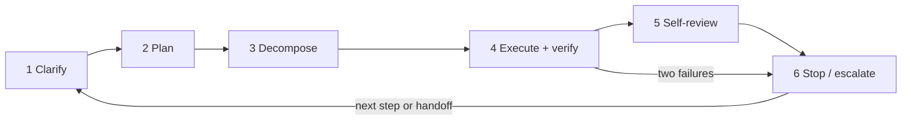
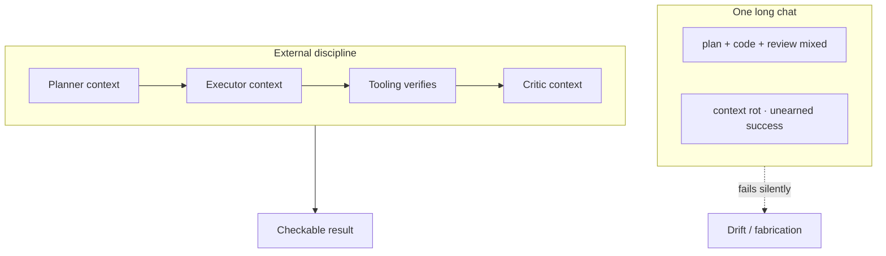
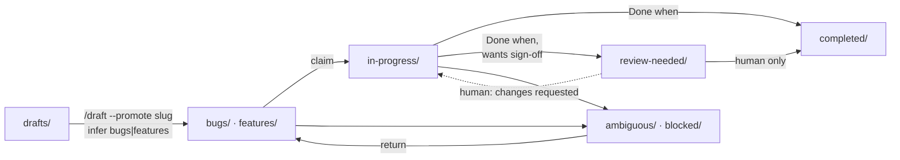
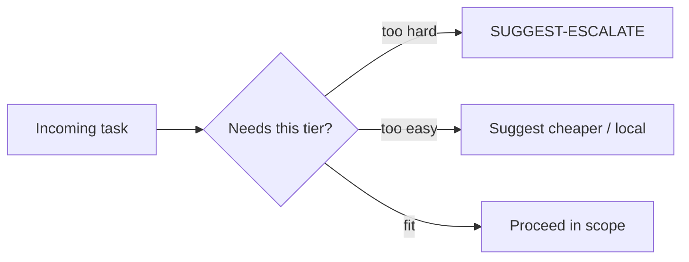

<!-- synced-from: anchor/ANCHOR.md @ 351117cab4c0a6d729db80e16f04674663d85969 -->

# The Doctrine

The behavioral contract in `anchor/ANCHOR.md` (scaffolded into projects as `.anchor/ANCHOR.md`), summarized. Every platform file, script, and MCP tool implements some slice of this.

## Six Mythos behaviors

Discipline is a **loop**, not a list of good intentions:

1. **Clarify before acting** — restate goal, constraints, acceptance criteria; ask one precise question if ambiguous, then stop.
2. **Plan before executing** — explicit numbered plan; planning and doing never interleave.
3. **Decompose ruthlessly** — each task fits one context window, touches one concern, verifies independently.
4. **Execute one step, then verify** — tooling runs the checks; model claims are inputs, not evidence.
5. **Self-review as a separate pass** — fresh-context critic against the original criteria.
6. **Know when to stop** — two failed attempts at the same error = stop and escalate. Never a third.

## Why external discipline beats better prompting

Small models drift, conflate planning with doing, declare unearned success, and fabricate under pressure. Telling them to "think carefully" doesn't fix this. What fixes it is structure **outside** the model:

- **Forced structure** — templates with mandatory sections; a model that must fill `## Acceptance criteria` cannot skip thinking about them. Outputs missing the required footer are rejected and retried by the pipeline, not forgiven.
- **One task per fresh context** — context rot hits small models hardest; never run task chains in one conversation.
- **Role separation** — planner → executor → critic as three clean contexts outperforms one long chat, even on the same model. In the orchestrated path the split is harness-enforced by the `scripts/roles.py` capability map (planner writes only `.plans/**`; executor never `.plans/**` or its own spec; critic writes nothing), applied per phase by `orchestrate.py` and by the project-orchestrator MCP server's role-scoped toolsets. Role transitions are logged orchestrator events; single-model sessions keep the discipline by prompt alone.
- **External verification** — tests, linters, builds, and diff-scope checks decide done-ness. Fleet runs pair the model’s claim with actual verify exits in `var/fleet-metrics/outcomes.jsonl`; aggregate with `fitness_report.py` and prefer those rates when updating model-fitness prose.
- **Escalation paths** — ambiguity, architecture, and twice-failed tasks go up a tier by rule, not by judgment.

## The templates

Four files in `.anchor/templates/` (source: `anchor/templates/`) are the doctrine's working surface: `plan.md` (planner output; Value / Preferred models when using `./.plans` — lane/lifecycle from **path**, not in-file Status/Lane), `task-spec.md` (the unit of dispatched work), `review.md` (critic pass), `verification.md` (tooling-filled done-ness table). The `mythos-core.md` system prompt binds any model to the six behaviors and the required output footer.

## Tracked plans (`./.plans`)

### Hard rule: docs describe current state, not plans

**For every project following Anchor:** documentation (README, `docs/`, CHANGELOG, blog, release notes, public prose) describes the **project as it exists now** — shipped code and public contracts. **Never** document the **contents** of `.plans/` (especially `drafts/`, ready backlog, in-progress bodies, unfinished acceptance items) as product docs or roadmap. When a plan’s work **ships**, document the code and public contract — not the plan file. **Allowed:** documenting how the `.plans/` **workflow** works when that is a shipped feature. **Forbidden:** “coming soon” from plan files; changelog/blog of unshipped backlog; citing plan slugs/paths as documentation.

In **projects that use Anchor**, git-tracked plans live under **`.plans/`** (dotdir; do not ignore the whole tree). Optional private plans: `<slug>.local.md` (gitignored via `.plans/.gitignore`). The **`.local` suffix is sticky** on promote and agent lane moves — only a human rename (or `/draft --shared` at create) makes a plan tracked. **Path is authoritative:**

Ready lanes are `bugs/` then `features/` (within a lane by `Priority` P1→P2→P3, default P2, then Value, then oldest first); agents move claimed work to `in-progress/` (only the claimer may continue — others ignore); may park half-baked or stuck work in `ambiguous/` or `blocked/`; may move work an agent believes is done to `review-needed/` for human sign-off before it's final (only a **human** may move `review-needed/` → `completed/`); finished work goes to `completed/`; never execute `drafts/`, `ambiguous/`, `blocked/`, or `review-needed/`. Do not put `Lane:` or `Status:` inside plan files. **Promotion** from drafts: [**`/draft --promote <slug>`**](/skills/draft) (user-authorized; agent infers bugs vs features from the plan) or a human move — never from `/work` or fleet pullers. Prefer [**`/draft`**](/skills/draft) to create/list/load drafts and [**`/work`**](/skills/work) to execute ready plans. Headless: `scripts/work_once.py --once --tier mid --agent-id …`. Multi-tier pollers: [Fleet workers](/tooling/fleet-workers). Preferred orchestrator: `anchor <dir> --set-orchestrator …` (if unset, frontier/near-frontier may act as temporary coordinator; lesser models escalate).

## Right-size before you start

Escalation isn't the only direction that matters — before spending an expensive tier's tokens, the model should ask whether the task actually needs them:

Boilerplate, formatting, a rename, or one well-specified function gets flagged, with a question about handing off to a smaller model or one already registered in `scripts/endpoints.yaml`, instead of silently burning frontier capacity. `scripts/router.py` implements the lookup.

*Right-sizing is one of the reasons [Savings](/savings) can be so large — please consider [donating](https://donate.stripe.com/28E6oHeq8fxQ5p7fmBdjO01) to help support this project.*

## When the tier you want is rationed

Subscription caps — session, rolling-window, weekly — are a scheduling problem, not a failure. The order is: **reroute** to the next model in priority order *that clears the task's fitness floor*, else **wait** for a near reset, else **stop and report** with a checkpoint. The trap is the middle column of [model fitness](/model-fitness): rerouting boilerplate down a tier is free, rerouting architecture or security work down a tier buys confident wrong answers. Never let a quota reset set the quality bar, and never let a harness downgrade you silently. Full doctrine: [capacity routing](/capacity-routing).

## Code quality defaults

SOLID principles apply by default, and composition follows whatever the target language calls idiomatic — traits (Rust), Protocols/narrow ABCs (Python), interfaces (TypeScript/Go/Java/C#), modules (Ruby) — never a deep inheritance tree. Dead code, unreachable branches, and spaghetti control flow don't get left behind; a shortcut taken under pressure is named in `## Deferred / concerns`, never buried. `scripts/anchor.py` detects a scaffolded project's language from marker files (`composer.json`, `package.json`, `Cargo.toml`, …) and writes the resolved idiom to `ANCHOR-CONVENTIONS.md`; co-located `package.json` yields to a backend marker when both are present. When detection fails, it asks, proposing the saved `config.sh` language default if one exists.
