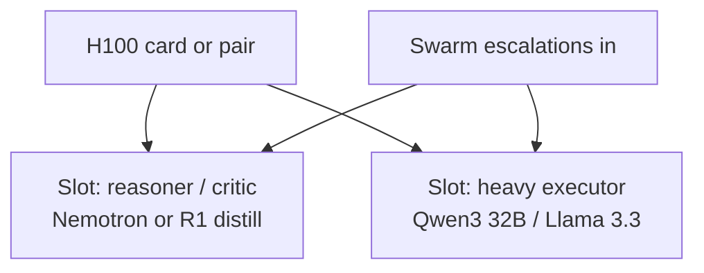

# H100 tier

The local frontier: planners, critics, heavy executors, and every escalation from the swarm.

## Layout

Two slots per card-or-pair: a **reasoner/critic** (Nemotron Super 49B via NIM, or [DeepSeek-R1](https://huggingface.co/collections/deepseek-ai/deepseek-r1) Distill-70B via vLLM) and a **heavy executor** ([Qwen3](https://qwen.readthedocs.io/en/latest/getting_started/quickstart.html) 32B FP8 or [Llama 3.3](https://huggingface.co/meta-llama/Llama-3.3-70B-Instruct) 70B AWQ). On a single 80GB card, either time-share the slots, or run Qwen3 32B FP8 with the `/think` toggle covering both roles acceptably.

## Role in the economics

This tier replaces credit-metered frontier calls for most judgment work — plans, reviews, twice-failed escalations. Keep a true frontier model only for the hardest architecture calls and final review of large merges. vLLM continuous batching means the whole swarm's escalations run concurrently; size `max_num_seqs` for it.

Reasoning models get token budgets (8–16k) and the LOW-CONFIDENCE stop rule — deliberation is the local analogue of credit burn.

*Keeping judgment local is a big part of the [Savings](/savings) story — please consider [donating](https://donate.stripe.com/28E6oHeq8fxQ5p7fmBdjO01) to help support this project.*
