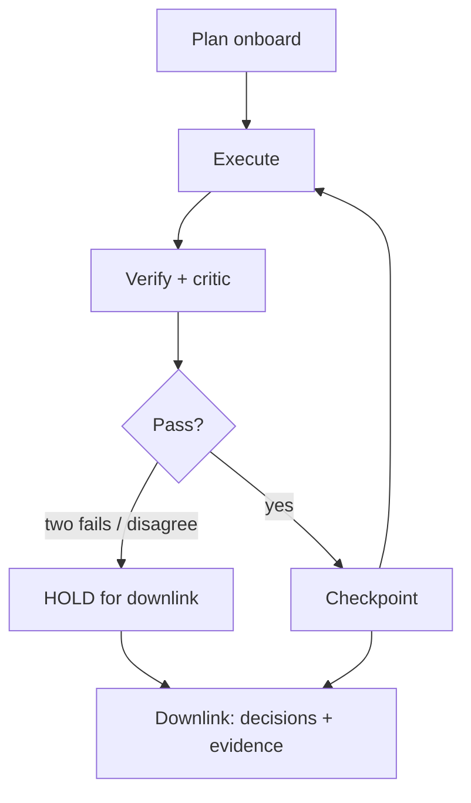

# Space-1 Vera Rubin

The **detached tier**: Vera Rubin-generation modules on the Space-1 platform — enormous compute that is operationally remote. High operator round-trip, windowed downlink, no hands-on recovery. Design assumption: *if a human must intervene mid-task, the task already failed.* Platform specifics are marked `unverified` until the real envelope is known.

## What detachment changes

The full Anchor pipeline — plan, execute, verify, review — runs onboard with no human in the loop. Downlink carries *decisions and evidence* (plans, diffs, verification tables, verdicts), not logs. Token budgets are power budgets: reasoning runs are scheduled, not default.

## Hard requirements (not recommendations, here)

1. No task without a machine-checkable definition of done
2. Critic pass on **every** task, always fresh-context — the critic is the stand-in for the human you don't have
3. Two failures → HOLD for the next downlink window (`orchestrate.py --hold-on-fail`); never a third attempt, never silent retries
4. Every accepted step checkpointed before the next begins; critical outputs verified twice by independent contexts (`delegate_parallel_review`), disagreement → HOLD

This tier is why the doctrine is written the way it is: prompting discipline stops being a cost optimization and becomes the only thing between the fleet and unrecoverable drift.
