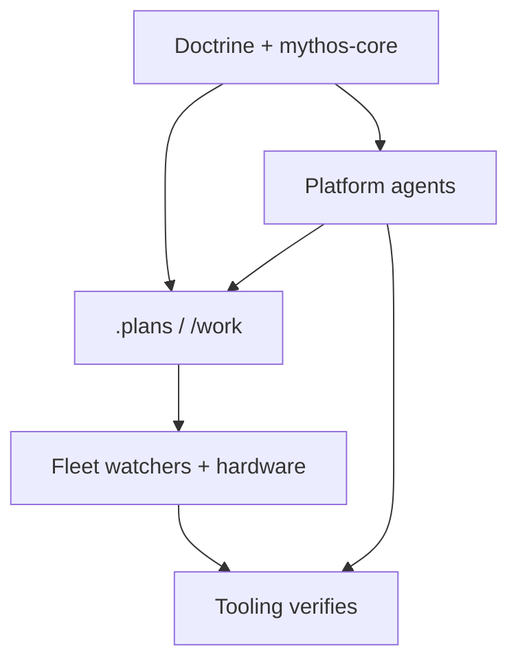
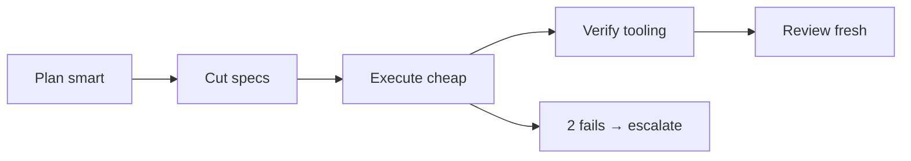

# Anchor

**Make less-powerful models behave like a Mythos-class model through structure, not capability.**

A Mythos-class model's advantage is disciplined process over long horizons — clarify, plan, decompose, execute verified steps, self-review, know when to stop. Lesser models can't be trusted to *maintain* that discipline, but they don't have to: Anchor imposes it externally through system prompts, forced output formats, one-task-per-context dispatch, and tooling-run verification.



## Where this comes from

Two ideas shaped the design:

**Treating the frontier model as a metered resource.** Once the frontier model is credit-metered, the winning move is the *orchestrator pattern*: the expensive model plans and reviews; cheap models execute; prompts get tuned on a cheap model before any expensive run; and you benchmark your own workload to learn which tasks actually deserve frontier pricing. Anchor generalizes that: the same economics apply when your "cheap models" are a rack of low-cost, always-on hardware.


**Field-tested choices for running capable models locally**: the [Qwen3](https://qwen.readthedocs.io/en/latest/getting_started/quickstart.html) family (especially 30B-A3B), [Gemma 3](https://ai.google.dev/gemma/docs/core), [Mistral Small](https://huggingface.co/mistralai/Mistral-Small-3.1-24B-Instruct-2503), [DeepSeek-R1 distills](https://huggingface.co/collections/deepseek-ai/deepseek-r1), and [Llama 3.3](https://huggingface.co/meta-llama/Llama-3.3-70B-Instruct) — served via llama.cpp or vLLM, quantized Q4, official chat templates, short contexts. Each name links to that model’s official quick start; Anchor adaptations are under [Local Models](platforms/local-models).

*Those wins add up — see [Savings](savings) for the scale of it, and please consider [donating](https://donate.stripe.com/28E6oHeq8fxQ5p7fmBdjO01) to help support this project.*

## The one-paragraph version

Plan on the smartest thing you can afford. Cut the plan into task specs that each fit one context window. Execute each spec on the cheapest model that passes your benchmarks, in a fresh context, with the Mythos-core system prompt. Verify with tooling, never with trust. Review with a fresh-context critic. Two failures anywhere = escalate a tier, never retry a third time. That's the whole system; everything else in this repo is plumbing for it.



*Projected inference savings are significant — details on the [Savings](savings) page. Please consider [donating](https://donate.stripe.com/28E6oHeq8fxQ5p7fmBdjO01) to help support this project.*

## Get the repo

Source lives at [github.com/carefreeinv/anchor](https://github.com/carefreeinv/anchor):

```bash
git clone https://github.com/carefreeinv/anchor.git
cd anchor
```

## Quick start

1. Read [the doctrine](doctrine) — everything else implements it.
2. Run `./config.sh` (or type `/config` in Claude Code / Grok Build) to pick your default platform(s), whether you want fleet tooling, **model priority**, and **preferred orchestrator** (who coordinates multi-step work and cross-plan **Depends on** analysis). It saves your answer and prints the exact `anchor <project-dir>` command to scaffold a project with it.
3. Scaffold a project: `anchor <project-dir>` (uses your saved defaults) or `anchor <project-dir> --platform claude,grok` (explicit). See the [CLI reference](tooling/cli) for `--fleet`, `--framework`, `--orchestrator` / `--set-orchestrator`, `--dry-run`, and `--check`.
4. Draft with [`/draft`](skills/draft) (`--list`, load existing, optional `--local`, `--promote <slug>` with inferred bugs/features). Execute ready plans with [`/work`](skills/work). Always-on pullers: [`/fleet-watch`](skills/fleet-watch). Architecture: [Fleet workers](tooling/fleet-workers).
5. Point `scripts/endpoints.yaml` at your endpoints; use `scripts/orchestrate.py` when you want the full plan→execute→critic loop — see [Hardware](hardware/h100).

`bin/anchor` (symlink onto your `PATH`) works with no install — `pip install -e .` from the repo root also works if you'd rather have a real `anchor` command.

## Start here

1. [The Doctrine](doctrine) — the behavioral contract everything implements
2. [The Playbook](playbook) — the economics that motivate it
3. [Savings](savings) — projected day/month/year inference savings + donate
4. [Skills](skills/draft) — `/draft`, `/work`, `/fleet-watch`, and friends
5. [Platforms](platforms/claude-code) — install instructions per agent/model
6. [Hardware](hardware/h100) — serve the fleet
7. [Tooling](tooling/scripts) — scripts, [fleet workers](tooling/fleet-workers), MCP, and the [`anchor` CLI](tooling/cli)
