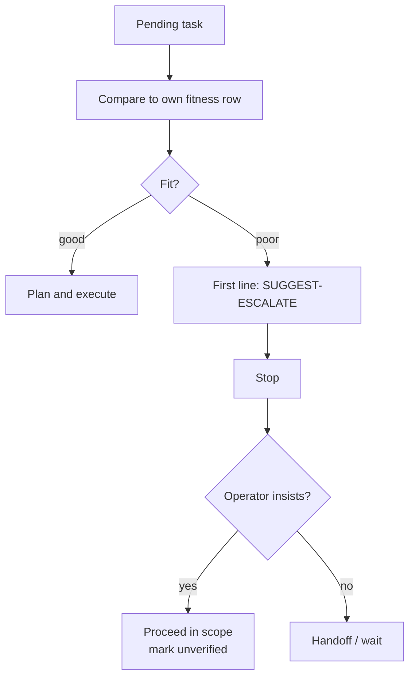

<!-- synced-from: anchor/model-fitness.md @ 0539f913aa3a822f15ac65db2b632cfeb0726c47 -->

# Model fitness

Where each supported model excels and where it fails — reviewed **2026-07-08** — plus the protocol that makes the list actionable: the **fit check**. Vendor-reported numbers stay `(unverified)` until your own `benchmark.py` run confirms them; your benchmark table, not this page, is your routing policy.

## The fit check

Every fleet worker gets mythos-core rule 11: before planning, compare the pending task against your own row. Fit is a **gate**, not a soft suggestion:

Poor fit → the entire first line is `SUGGEST-ESCALATE: <better-suited model> — <reason>`, then stop. The operator can insist (`orchestrate.py --insist`), and the worker then proceeds strictly in scope with shaky output marked `(unverified)`. Scaffolded projects carry the operator's model-priority order in `ANCHOR-CONVENTIONS.md`, so the suggestion names the nearest better-fitting model from *that user's* list. Suggesting down-tier is equally required — boilerplate on a frontier model is the mirror-image failure.

**What does *not* trigger the fit check.** The gate is your **weak column** and orchestration-class work — nothing wider. Do not escalate because a stronger model exists (true of nearly every task), because a plan's **Preferred models** names one (only the listed *tiers* set the floor; a list with no tier and no name you match is *unknown* fit, which is **eligible**), because the task is unfamiliar or multi-file, or because a single step looks hard (claim the plan and route *that step*). Over-shy escalation is a real failure mode, not the safe default: the plan sits in the backlog, the operator waits, and a model that could have finished it is idle. It just fails quietly.

`orchestrate.py` honors a `SUGGEST-ESCALATE` first line immediately (escalate, or hold in detached mode) without burning retry attempts.

## Frontier / API models

| Model | Excels at | Weak at / quirks |
|---|---|---|
| Claude Fable 5 | Long-horizon autonomy, large migrations, multi-service debugging, final review | Credit-metered — keystrokes on it are an economics failure |
| Claude Opus 4.8 | Deep single-problem reasoning, architecture, security | Overkill for scoped edits |
| Claude Sonnet 5 | Default executor: scoped multi-file edits, solid tool use | Hands multi-hour autonomy up a tier |
| Claude Haiku 4.5 | Classification, summaries, spec-tuning | Multi-file reasoning, subtle bugs |
| GPT-5.6 Sol | Agentic coding + cybersecurity `(unverified, vendor)` | System-card-documented over-eagerness: unrequested actions, claiming unperformed work |
| GPT-5.6 Terra | ~GPT-5.5 quality at ~half cost — the executor pick | Same system-card caveats as Sol |
| GPT-5.6 Luna | Frontier-adjacent at $1/$6 — tuner/light executor | Keep off architecture and review |
| ChatGPT (GPT-5.5 + Instant Mini fallback) | Conversational spec-shaping, piloted one-step turns | No execution; fallback varies the tier mid-session |
| Grok 4.5 | Terminal/CLI tasks (≈GPT-5.5 class), long tool-use runs, token efficiency, price; **Preferred catalog tier = mid** | Measurably weaker at repo-scale issue resolution — decompose to file-scoped specs; `reasoning_effort` defaults high (use `/effort low` for mechanical); high effort ≠ frontier promotion; community-reported tool-use flakiness |
| Gemini 2.5-class | Long-context ingestion, multimodal | Same external-verification rules as everyone |
| Nemotron (NIM) | Local planner/critic stand-in; clean thinking toggle | Fabricates unfamiliar APIs under pressure |

## Local models

Model names link to the **official quick start**. See also [Local Models](/platforms/local-models) for Anchor quirks and serve notes.

| Model | Excels at | Weak at / quirks |
|---|---|---|
| [Qwen3](https://qwen.readthedocs.io/en/latest/getting_started/quickstart.html) 32B / 30B-A3B | Spec-driven edits; 32B `/think` checklist critic | Small plans only as planner; never greedy while thinking |
| [Gemma 3](https://ai.google.dev/gemma/docs/core) 27B | Best instruction following per size | No system role; agreeable — needs the BLOCKED guardrail |
| [Mistral Small 3.x](https://huggingface.co/mistralai/Mistral-Small-3.1-24B-Instruct-2503) | Fast executor, best local function calling | Terse — drops footers under load; won't push back |
| [DeepSeek-R1 distills](https://huggingface.co/collections/deepseek-ai/deepseek-r1) | Best local critic per GB; hard single problems | Never an executor; no system prompt; greedy breaks it |
| [Llama 3.3 70B](https://huggingface.co/meta-llama/Llama-3.3-70B-Instruct) | Generalist executor+critic | Confident fabrication; verbose without caps |

The full matrix with pricing, dates, and per-entry sourcing lives in `anchor/model-fitness.md` in this repo, and is scaffolded into projects as `.anchor/model-fitness.md`.

## Observed data (preferred over vendor claims)

After fleet runs, prefer **local** claim-vs-actual rates over vendor scorecards:

1. **Ledger** — `var/fleet-metrics/outcomes.jsonl` (metadata only), written by `orchestrate.py` via `scripts/fleet_metrics.py`.
2. **Report** — `python scripts/fitness_report.py` or `--json`. Rates with **n < 5** are withheld.
3. **Humans** edit `model-fitness.md` from the report; nothing auto-rewrites doctrine.

Rotate the JSONL manually if it grows large.
