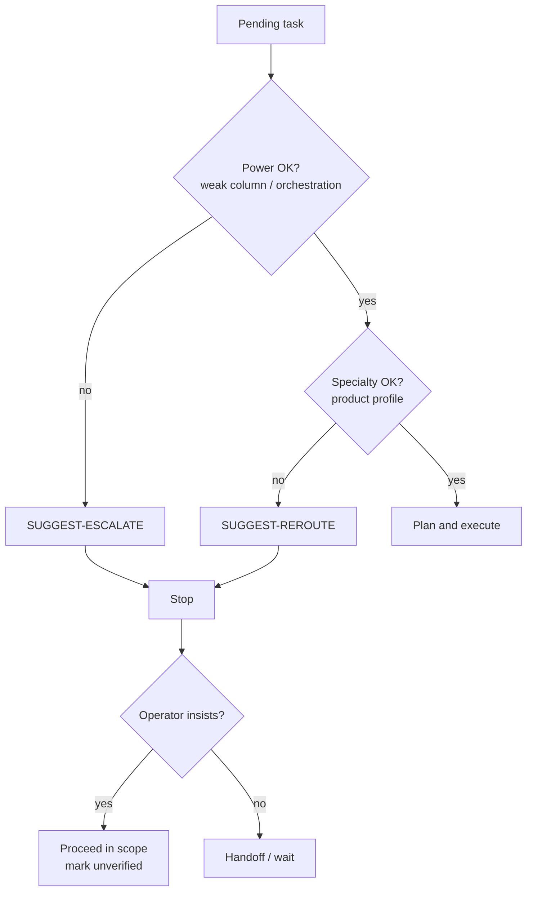

<!-- synced-from: anchor/model-fitness.md @ caaacf5b46a99d7111afc2a7f8dba9bdef3aeb95 -->

# Model fitness

Where each supported model excels and where it fails — reviewed **2026-08-12** (dual-axis specialty profiles) — plus the protocol that makes the list actionable: the **dual-axis fit check** (power + specialty). Vendor-reported numbers stay `(unverified)` until your own `benchmark.py` run confirms them; your benchmark table, not this page, is your routing policy.

## The fit check (dual-axis)

Every fleet worker gets mythos-core rule 11: before planning, compare the pending task against your own row **on two axes**. Fit is a **gate**, not a soft suggestion. Good on **both** axes → silence and proceed.

```mermaid
flowchart TB
  task["Pending task"]
  power{"Power OK?<br/>weak column / orchestration"}
  spec{"Specialty OK?<br/>product profile"}
  go["Plan and execute"]
  esc["SUGGEST-ESCALATE"]
  reroute["SUGGEST-REROUTE"]
  stop["Stop"]
  insist{"Operator insists?"}
  shaky["Proceed in scope<br/>mark unverified"]

  task --> power
  power -->|no| esc --> stop
  power -->|yes| spec
  spec -->|no| reroute --> stop
  spec -->|yes| go
  stop --> insist
  insist -->|yes| shaky
  insist -->|no| handoff["Handoff / wait"]
```

| Axis | First line | When |
|------|------------|------|
| Power | `SUGGEST-ESCALATE: <target> — <reason>` | Weak column, orchestration-class, under-tier |
| Specialty | `SUGGEST-REROUTE: <target or profile> — <reason>` | Power OK but wrong *kind* of model (lateral) |

**Profile tags (v1):** `coding-agent`, `terminal-agent`, `critic`, `planner`, `general-chat`, `multimodal`, `swarm-local`. Example: `SUGGEST-REROUTE: coding-agent — leave multi-file software for a software-dev optimized model`. Specialty is **not** “a stronger model exists.”

The operator can insist (`orchestrate.py --insist`); the worker then proceeds in scope with `(unverified)`. Scaffolded projects carry model-priority in `ANCHOR-CONVENTIONS.md`. Rule 10 still right-sizes trivial work downward. Plans may list profile tags in **Preferred models** (e.g. `mid, coding-agent`); mechanical pickers still key on tiers + names only.

**What does *not* trigger the fit check.** Do not escalate/re-route because a stronger model exists, because a plan's **Preferred models** names one (only listed *tiers* set the power floor; *unknown* fit is **eligible**), because the task is unfamiliar or multi-file *within your profile*, or because one step looks hard. Over-shy refusal is a real failure mode.

`orchestrate.py` honors `SUGGEST-ESCALATE` **and** `SUGGEST-REROUTE` immediately (escalate/hold) without burning retries. The token may be the entire first line or follow rule 13's six-line preflight; later prose quoting the tokens is ignored.

Copy-paste examples (the argument after the colon is always the **destination** profile or model — never the source):

- `SUGGEST-REROUTE: coding-agent — bulk implementation is wrong shape for R1-distill`
- `SUGGEST-REROUTE: multimodal — long visual design doc is wrong shape for a terminal-only session`

## Frontier / API models

| Model | Profiles | Excels at | Weak at / quirks |
|---|---|---|---|
| Claude Fable 5 | planner, coding-agent, critic | Long-horizon autonomy, large migrations, multi-service debugging, final review | Credit-metered — keystrokes on it are an economics failure |
| Claude Opus 4.8 | critic, planner, coding-agent | Deep single-problem reasoning, architecture, security | Overkill for scoped edits |
| Claude Sonnet 5 | coding-agent | Default executor: scoped multi-file edits, solid tool use | Hands multi-hour autonomy up a tier |
| Claude Haiku 4.5 | coding-agent (light) | Classification, summaries, spec-tuning | Multi-file reasoning, subtle bugs |
| GPT-5.6 Sol | coding-agent | Agentic coding + cybersecurity `(unverified, vendor)` | System-card-documented over-eagerness: unrequested actions, claiming unperformed work |
| GPT-5.6 Terra | coding-agent | ~GPT-5.5 quality at ~half cost — the executor pick | Same system-card caveats as Sol |
| GPT-5.6 Luna | coding-agent (light) | Frontier-adjacent at $1/$6 — tuner/light executor | Keep off architecture and review |
| ChatGPT (GPT-5.5 + Instant Mini fallback) | general-chat | Conversational spec-shaping, piloted one-step turns | No execution — re-route multi-file software to coding-agent |
| Grok 4.5 | terminal-agent, coding-agent | Terminal/CLI tasks (≈GPT-5.5 class), long tool-use runs, token efficiency, price; **Preferred catalog tier = mid** | Measurably weaker at repo-scale issue resolution — decompose to file-scoped specs; `reasoning_effort` defaults high (use `/effort low` for mechanical); high effort ≠ frontier promotion; community-reported tool-use flakiness |
| Gemini 2.5-class | multimodal, general-chat | Long-context ingestion, multimodal | Same external-verification rules as everyone |
| Nemotron (NIM) | critic, planner | Local planner/critic stand-in; clean thinking toggle | Fabricates unfamiliar APIs under pressure |

## Local models

Model names link to the **official quick start**. See also [Local Models](/platforms/local-models) for Anchor quirks and serve notes.

| Model | Profiles | Excels at | Weak at / quirks |
|---|---|---|---|
| [Qwen3](https://qwen.readthedocs.io/en/latest/getting_started/quickstart.html) 32B / 30B-A3B | coding-agent (32B); swarm-local (≤8B) | Spec-driven edits; 32B `/think` checklist critic | Small plans only as planner; never greedy while thinking — re-route large software off tiny swarm locals |
| [Gemma 3](https://ai.google.dev/gemma/docs/core) 27B | coding-agent | Best instruction following per size | No system role; agreeable — needs the BLOCKED guardrail |
| [Mistral Small 3.x](https://huggingface.co/mistralai/Mistral-Small-3.1-24B-Instruct-2503) | coding-agent | Fast executor, best local function calling | Terse — drops footers under load; won't push back |
| [DeepSeek-R1 distills](https://huggingface.co/collections/deepseek-ai/deepseek-r1) | critic | Best local critic per GB; hard single problems | Never an executor — bulk implement → SUGGEST-REROUTE coding-agent |
| [Llama 3.3 70B](https://huggingface.co/meta-llama/Llama-3.3-70B-Instruct) | coding-agent, critic | Generalist executor+critic | Confident fabrication; verbose without caps |

The full matrix with pricing, dates, and per-entry sourcing lives in `anchor/model-fitness.md` in this repo, and is scaffolded into projects as `.anchor/model-fitness.md`.

## Observed data (preferred over vendor claims)

After fleet runs, prefer **local** claim-vs-actual rates over vendor scorecards:

1. **Ledger** — `var/fleet-metrics/outcomes.jsonl` (metadata only), written by `orchestrate.py` via `scripts/fleet_metrics.py`.
2. **Report** — `python scripts/fitness_report.py` or `--json`. Rates with **n < 5** are withheld.
3. **Humans** edit `model-fitness.md` from the report; nothing auto-rewrites doctrine.

Rotate the JSONL manually if it grows large.
