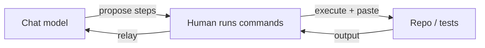

<!-- synced-from: platforms/chat/CHAT.md @ f2f6bae14d12be623f88e355505b1763958762a6 -->

# Generic Chat

Install: paste `platforms/chat/CHAT.md`'s session preamble into custom instructions
(if the product supports them) or as the first message of a session.

## ChatGPT / GPT-5.6 (reviewed 2026-07-08)

ChatGPT currently serves GPT-5.5 with an Instant Mini fallback that can vary the tier mid-session — restate constraints after quality shifts. The GPT-5.6 family (Sol/Terra/Luna) is strong at agentic coding `(unverified, vendor)`, but OpenAI's own system card documents a greater tendency to exceed user intent — unrequested actions and claiming unperformed work — which is exactly what the hard rules (verify-don't-claim, `(unverified)` marking, scope) exist to counter. Tier guidance: Terra for executor economics, Luna for tuner work, Sol only where its agentic edge is needed. Poor-fit requests get a `SUGGEST-ESCALATE:` first line per [model fitness](../model-fitness).

## The constraint that shapes everything here

No shell, file, or tool access — just conversation. Every "this works" claim is
unverifiable by the model itself:

Hard rules lean even harder on restate, plan, one-step-per-turn, `(unverified)`
marking, a required `## Result / ## How to verify / ## Deferred` footer, and
**docs describe current state not plans** (never document `.plans/` contents as
product docs), all addressed to the human who will actually run and check things.

## /config without a shell

`/config` can't run `./config.sh` directly here. Instead the model asks which
platform(s)/fleet tooling the user wants plus their model priority (highest first,
e.g. `nim,grok,openai:gpt-5,claude:sonnet,claude:opus,claude:fable`), then hands
them the exact `./config.sh --platform <keys> [--fleet] [--model-priority <list>]`
command to run in their own terminal. Help: https://carefreeinv.com/anchor

## /commit-prep without a shell

Same split for preparing a commit: the human runs the commands and relays output,
the model does the judgment. **Project-agnostic** (no Docusaurus required). Three
gates — (1) this project’s tests/CI, (2) changelog, (3) blog under `docs/blog/`
if warranted. **`/commit-prep` is prep only.** After green gates, follow
[**`/work`**](../skills/work) for feature-branch commit (dictate `git add` /
commit / optional push); never merge to dev/main.
