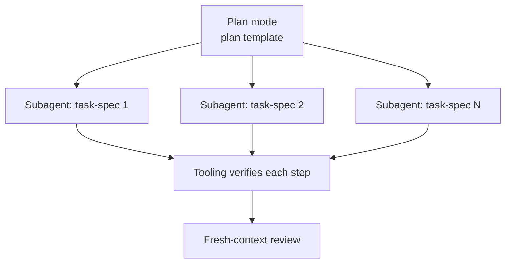

<!-- synced-from: platforms/claude-code/CLAUDE.md @ 0a459b66e22ef564ba880605b2f13ca5591006a9 -->
---
sidebar_position: 1
sidebar_label: Claude Code
---

<!-- synced-from: platforms/claude-code/CLAUDE.md @ PENDING -->

# Claude Code

Install: copy `platforms/claude-code/CLAUDE.md` into your repo root (or merge into an existing CLAUDE.md), and connect both MCP servers:

```bash
claude mcp add anchor-prompts -- python /abs/path/mcp/anchor-prompts/server.py
claude mcp add model-fleet   -- python /abs/path/mcp/model-fleet/server.py
```

## What it changes

**Model routing.** Sonnet is the execution default; Opus takes deep reasoning and security-adjacent work (skip the classifier tax); the frontier model is reserved for multi-hour autonomy — and even then, prefer plan-then-delegate.

**Plan-then-delegate.** Anything beyond one session/one file: plan mode first (plan template), each step becomes a subagent with a self-contained task spec, tooling verifies each step, fresh-context review at the end. Subagents never see the whole conversation — just their spec.



**Fleet offload.** With `model-fleet` connected, mechanical steps go to your own hardware (`delegate` tool) before spending plan-limit tokens. The frontier agent stays the judge, your fleet becomes the hands.

**Standing rules** apply to every tier: fit-check-first (a task in the current model's weak column per [model fitness](/model-fitness) opens with `SUGGEST-ESCALATE:` and stops unless the user insists — the weak column and orchestration-class work are the *whole* gate; a stronger model merely existing, a plan naming one, or one hard-looking step are not reasons to hand work back), restate-first, **surface the best-fit skill** (before acting, offer an available skill or command that would do the request faster in a single line, then proceed — a suggestion, not a gate; only skills actually loaded, at most once per capability per session), one step at a time, verify-don't-claim, two-failures-then-escalate, scope is sacred, required output footer, **docs describe current state not plans** (never document `.plans/` contents as product docs; document shipped code only), **`/commit-prep` before any `git commit`**, and **capacity limits are a scheduling problem** — on a session/weekly cap or a forced tier downgrade, checkpoint and then reroute to the next model that clears the task's fitness floor, wait for a near reset, or stop and report (see [capacity routing](/capacity-routing)); never finish on a silently downgraded tier and never weaken the work to beat a cap.

## Tracked plans

Scaffold installs [**`/draft`**](/skills/draft), [**`/work`**](/skills/work), [**`/review`**](/skills/review), [**`/fleet-watch`**](/skills/fleet-watch), [**`/install-anchor`**](/skills/install-anchor), [**`/anchor`**](/skills/anchor) (conform **this** project; CWD default), and [**`/local-models`**](/skills/local-models). Draft: create/list/load/`--promote <slug>` (infer bugs vs features); optional `--local`. `/work`: Preferred models, Depends on, claim → `in-progress/`, finish → `review-needed/` (human `/review` Approve merges feature→`dev` then → `completed/`; empty queue may Promote `dev`→`main`); Git: **worktree per agent** (`worktree_for_agent.py`), feature branches from `dev`/`develop` (**create `dev` from main/master if missing**); `/work` never merges. Set Preferred orchestrator via `anchor --set-orchestrator`. `/install-anchor` registers the CLI on PATH (user-local symlink, no sudo). See source `platforms/claude-code/CLAUDE.md`.

## /commit-prep

**Required before any `git commit`.** Agents run `/commit-prep` (discover this project’s tests/CI; CHANGELOG; blog-if-warranted — no Docusaurus required). **Prep only** — does not commit. After a green prep, [**`/work`**](/skills/work) / standing rules cover feature-branch commit (worktree preferred; never merge to dev/main).

## Suggested automation

PostToolUse hook running the linter; pre-commit running the current step's definition-of-done; git worktrees for parallel subagent tasks.
