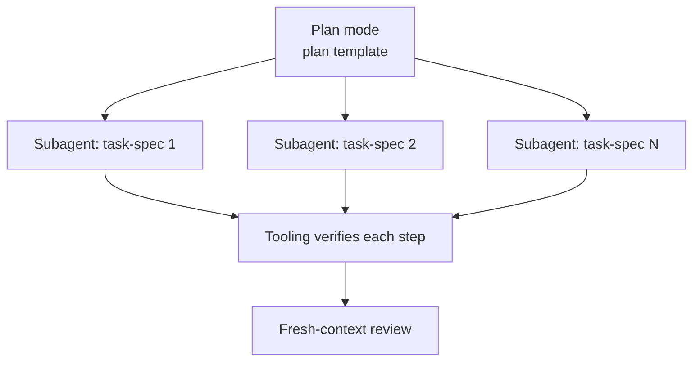

<!-- synced-from: platforms/claude-code/CLAUDE.md @ acd45dfdf34cd50fbf30ddacdbf90347201e9b95 -->

# Claude Code

Install: copy `platforms/claude-code/CLAUDE.md` into your repo root (or merge into an existing CLAUDE.md), and connect both MCP servers:

```bash
claude mcp add anchor-prompts -- python /abs/path/mcp/anchor-prompts/server.py
claude mcp add model-fleet   -- python /abs/path/mcp/model-fleet/server.py
```

## What it changes

**Model routing.** Sonnet is the execution default; Opus takes deep reasoning and security-adjacent work (skip the classifier tax); the frontier model is reserved for multi-hour autonomy — and even then, prefer plan-then-delegate.

**Plan-then-delegate.** Anything beyond one session/one file: plan mode first (plan template), each step becomes a subagent with a self-contained task spec, tooling verifies each step, fresh-context review at the end. Subagents never see the whole conversation — just their spec.



**Fleet offload.** With `model-fleet` connected, mechanical steps go to your own hardware (`delegate` tool) before spending plan-limit tokens. The frontier agent stays the judge, your fleet becomes the hands.

**Standing rules** apply to every tier: fit-check-first (a task in the current model's weak column per [model fitness](../model-fitness) opens with `SUGGEST-ESCALATE:` and stops unless the user insists), restate-first, one step at a time, verify-don't-claim, two-failures-then-escalate, scope is sacred, required output footer, **docs describe current state not plans** (never document `.plans/` contents as product docs; document shipped code only).

## Tracked plans

Scaffold installs [**`/draft`**](../skills/draft), [**`/work`**](../skills/work), and [**`/fleet-watch`**](../skills/fleet-watch). Draft: create/list/load/`--promote <slug>` (infer bugs vs features); optional `--local`. `/work`: Preferred models, Depends on, claim → `in-progress/`, finish → `completed/`. Set Preferred orchestrator via `anchor --set-orchestrator`. See source `platforms/claude-code/CLAUDE.md`.

## Suggested automation

PostToolUse hook running the linter; pre-commit running the current step's definition-of-done; git worktrees for parallel subagent tasks.
