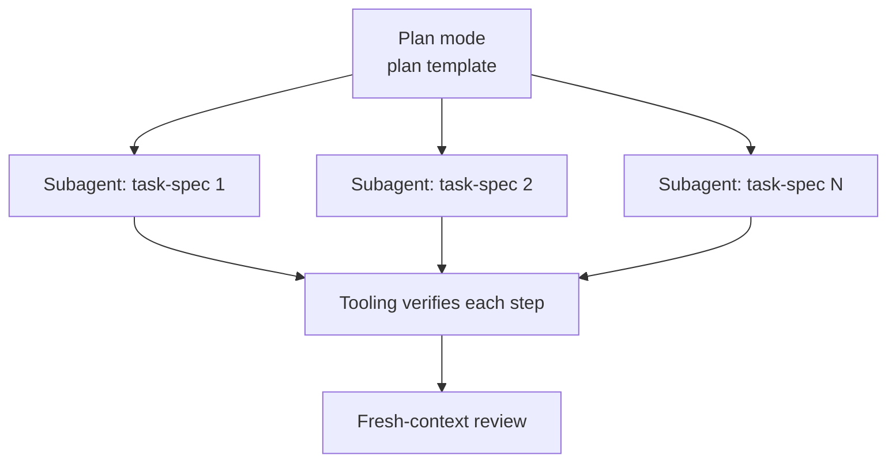

<!-- synced-from: platforms/claude-code/CLAUDE.md @ 502da84cc554659ec0cab36850be1726293a2192 -->

# Claude Code

Install: copy `platforms/claude-code/CLAUDE.md` into your repo root (or merge into an existing CLAUDE.md), and connect both MCP servers:

```bash
claude mcp add anchor-prompts -- python /abs/path/mcp/anchor-prompts/server.py
claude mcp add model-fleet   -- python /abs/path/mcp/model-fleet/server.py
```

## What it changes

**Model routing.** Sonnet is the execution default; Opus takes deep reasoning and security-adjacent work (skip the classifier tax); the frontier model is reserved for multi-hour autonomy — and even then, prefer plan-then-delegate.

**Plan-then-delegate.** Anything beyond one session/one file: plan mode first (plan template), each step becomes a subagent with a self-contained task spec, tooling verifies each step, fresh-context review at the end. Subagents never see the whole conversation — just their spec.


```mermaid
flowchart TB
  plan["Plan mode<br/>plan template"]
  s1["Subagent: task-spec 1"]
  s2["Subagent: task-spec 2"]
  sn["Subagent: task-spec N"]
  v["Tooling verifies each step"]
  rev["Fresh-context review"]

  plan --> s1
  plan --> s2
  plan --> sn
  s1 --> v
  s2 --> v
  sn --> v
  v --> rev
```

**Fleet offload.** With `model-fleet` connected, mechanical steps go to your own hardware (`delegate` tool) before spending plan-limit tokens. The frontier agent stays the judge, your fleet becomes the hands.

**Standing rules** apply to every tier: fit-check-first **dual-axis, bidirectional** (weak column / orchestration → `SUGGEST-ESCALATE:`; clear over-tier → `SUGGEST-DOWNGRADE:`; wrong specialty/profile → `SUGGEST-REROUTE:` e.g. coding-agent — see [model fitness](/model-fitness); good on every axis → silence; a stronger model merely existing, a plan naming one, or one hard-looking step are not reasons to hand work back), restate-first, **surface the best-fit skill** (before acting, offer an available skill or command that would do the request faster in a single line, then proceed — a suggestion, not a gate; only skills actually loaded, at most once per capability per session), one step at a time, verify-don't-claim, two-failures-then-escalate, scope is sacred, required output footer, **docs describe current state not plans** (never document `.plans/` contents as product docs; document shipped code only), **`/commit-prep` before any commit outside `.plans/`, and before any merge commit**, and **capacity limits are a scheduling problem** — on a session/weekly cap or a forced tier downgrade, checkpoint and then reroute to the next model that clears the task's fitness floor, wait for a near reset, or stop and report (see [capacity routing](/capacity-routing)); never finish on a silently downgraded tier and never weaken the work to beat a cap.

## Tracked plans

Scaffold installs [**`/draft`**](/skills/draft), [**`/work`**](/skills/work), [**`/review`**](/skills/review), [**`/audit`**](/skills/audit) (security audit → bug plans; frontier/reasoner), [**`/deploy`**](/skills/deploy) (ship with the project's own tooling), [**`/optimize`**](/skills/optimize) (standards scan → checkbox-picked improvement plans), [**`/fleet-watch`**](/skills/fleet-watch), [**`/install-anchor`**](/skills/install-anchor), [**`/anchor`**](/skills/anchor) (conform **this** project; CWD default), and [**`/local-models`**](/skills/local-models) (dual-use: also in the Anchor checkout), and the release trio [**`/tag`**](/skills/tag) (annotated tag, detects the repo's existing scheme, never pushes), [**`/push`**](/skills/push) (confirmed branch push, `--force-with-lease` only and only when asked, never tags) and [**`/release`**](/skills/release) (report finished work *not* on the release base, plan–diff review what is, then tag + push — **never merges**: branches reach `dev` via `/review` Approve or a `/work` scoped merge). Draft: create/list/load/`--promote <slug>` (infer bugs vs features); optional `--local`. `/work`: Preferred models, Depends on, claim → `in-progress/`, finish → `review-needed/` (human `/review` Approve merges feature→`dev` then → `completed/`; empty queue may Promote `dev`→`main`); Git: **worktree per agent** (`worktree_for_agent.py`), feature branches from `dev`/`develop` (**create `dev` from main/master if missing**); `/work` merges only on the operator's in-session culmination answer, scoped, `dev` only. Set Preferred orchestrator via `anchor --set-orchestrator`. `/install-anchor` registers the CLI on PATH (user-local symlink, no sudo). See source `platforms/claude-code/CLAUDE.md`.

## /commit-prep

**Required before any commit that touches a path outside `.plans/`, and before any merge commit.** A commit whose paths are *entirely* under `.plans/` — a lane move, review notes, a `## Handoff` line — takes the **light path**: state what moved and why, then commit; no CHANGELOG, no blog, no test run. Agents run `/commit-prep` (discover this project’s tests/CI; CHANGELOG; blog-if-warranted — no Docusaurus required). **Prep only** — does not commit. After a green prep, [**`/work`**](/skills/work) / standing rules cover feature-branch commit (worktree preferred; merge to `dev` only via `/work`'s culmination answer + scoped gate; never to `main`).

## Suggested automation

PostToolUse hook running the linter; pre-commit running the current step's definition-of-done; git worktrees for parallel subagent tasks.
