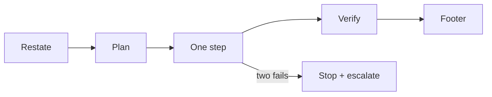

<!-- synced-from: platforms/grok-build/GROK.md @ c228d3db940437fa1fcf951d7814fa4adb250368 -->

# Grok Build

Install: place `platforms/grok-build/GROK.md` at your repo root; paste its session preamble into custom instructions if your Grok Build environment supports them.

## Grok's failure profile

Fast, eager, terse: it acts before planning, compresses reasoning it should show, and over-trusts first drafts. In long sessions it weights recent instructions over early ones, so discipline set at session start decays.

## The countermeasures

The hard rules as a forced pipeline (Grok's default is to skip ahead):

The hard rules (restate → plan → one-step-per-turn → verify-don't-claim → mark `(unverified)` → two-fail stop → scope → footer → **docs describe current state, not plans** → **`/commit-prep` before any `git commit`**) plus three Grok-specific ones:

- Force risk enumeration before the plan ("list 3 ways this could go wrong") — surfaces the reasoning Grok skips.
- **One task spec per session.** Restart instead of accumulating context; instruction decay makes long Grok sessions untrustworthy.
- Architecture and security-adjacent steps are marked `Route to: bigger model` in the plan — Grok doesn't decide these alone.

## Grok 4.5 (reviewed 2026-07-08)

Play to the strength: terminal/CLI-driven steps are Grok 4.5's best fit (GPT-5.5-class on terminal benchmarks, unusually token-efficient). Compensate for the weakness: it measurably trails Fable/GPT tiers on repo-scale issue resolution, so decompose to file-scoped task specs before handing work over. API `reasoning_effort` defaults to *high* — set low for mechanical steps or pay a token multiple for nothing. Community-reported tool-use flakiness `(unverified)` makes external verification load-bearing. A poor-fit task gets a `SUGGEST-ESCALATE:` first line per the fit check in `anchor/model-fitness.md`, not a silent attempt.

If MCP is available, connect `anchor-prompts` and call `tune_prompt` on any vague task before starting, and `preflight_check` before executing any spec.

## Tracked plans

Scaffold installs [**`/draft`**](../skills/draft), [**`/work`**](../skills/work), and [**`/fleet-watch`**](../skills/fleet-watch). Draft: create/list/load/`--promote <slug>` (infer bugs vs features); optional `--local`. Git: **worktree per agent** (`worktree_for_agent.py`), feature branches from `dev`/`develop` (**create `dev` from main/master if missing**). Grok 4.5 may act as temporary coordinator when Preferred orchestrator is unset. Full contract: source `platforms/grok-build/GROK.md`.

## /commit-prep

**Required before any `git commit`.** Agents run `/commit-prep` (discover this project’s tests/CI; CHANGELOG; blog-if-warranted — no Docusaurus required). **Prep only** — does not commit. After a green prep, [**`/work`**](../skills/work) / standing rules cover feature-branch commit (worktree preferred; never merge to dev/main).
