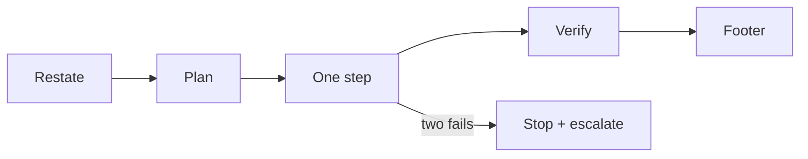

<!-- synced-from: platforms/grok-build/GROK.md @ 1afb071e0b103e7818e2e21496f38fd8f8869eaa -->

# Grok Build

Install: place `platforms/grok-build/GROK.md` at your repo root; paste its session preamble into custom instructions if your Grok Build environment supports them.

## Grok's failure profile

Fast, eager, terse: it acts before planning, compresses reasoning it should show, and over-trusts first drafts. In long sessions it weights recent instructions over early ones, so discipline set at session start decays.

## The countermeasures

The hard rules as a forced pipeline (Grok's default is to skip ahead):

```mermaid
flowchart LR
  r["Restate"]
  p["Plan"]
  s["One step"]
  v["Verify"]
  f["Footer"]
  r --> p --> s --> v --> f
  s -->|"two fails"| stop["Stop + escalate"]
```

The hard rules (restate → plan → one-step-per-turn → verify-don't-claim → mark `(unverified)` → two-fail stop → scope → footer → **docs describe current state, not plans** → **`/commit-prep` before any `git commit`** → **capacity limits are a scheduling problem**, not a failure: checkpoint, then reroute to the next model clearing the task's fitness floor, wait for a near reset, or stop and report — see [capacity routing](/capacity-routing) → **surface the best-fit skill**: before acting, offer an available `.grok/skills/` skill or command that fits the request in one line, then proceed — a suggestion, not a gate; only skills actually loaded, at most once per capability per session) plus three Grok-specific ones:

- Force risk enumeration before the plan ("list 3 ways this could go wrong") — surfaces the reasoning Grok skips.
- **One task spec per session.** Restart instead of accumulating context; instruction decay makes long Grok sessions untrustworthy.
- Architecture and security-adjacent steps are marked `Route to: bigger model` in the plan — Grok doesn't decide these alone.

## Grok 4.6 (and 4.5) (reviewed 2026-08-12)

Prefer **Grok 4.5** for lighter/cheaper mid (file-scoped execute, terminal/CLI); **Grok 4.6** for sustained multi-step agent work. Priority tokens: `grok:4.5`, `grok:4.6`. Play to terminal/CLI and multi-step loops; decompose repo-scale issues to file-scoped specs. Base catalog tier is **mid**. A **reported** `reasoning_effort` sets **effective** Preferred tier (`low`→mid, `medium`/`high`→reasoner, `xhigh`→frontier on 4.6; 4.5 `xhigh` coerces to high → reasoner). Omitted effort stays mid. TUI: **`/effort low|medium|high|xhigh`**. Dual-axis fit: power → `SUGGEST-ESCALATE:`; specialty mismatch → `SUGGEST-REROUTE:`. Mid is a floor Grok clears — do not skip file-scoped `mid` plans because Preferred also names a stronger product. Reported `high` *does* make Grok effective reasoner (skips mid-only Preferred).

If MCP is available, connect `anchor-prompts` and call `tune_prompt` on any vague task before starting, and `preflight_check` before executing any spec.

## Tracked plans

Scaffold installs [**`/draft`**](/skills/draft), [**`/work`**](/skills/work), [**`/review`**](/skills/review), [**`/audit`**](/skills/audit) (security audit → bug plans; frontier/reasoner), [**`/deploy`**](/skills/deploy) (ship with the project's own tooling), [**`/optimize`**](/skills/optimize) (standards scan → checkbox-picked improvement plans), [**`/fleet-watch`**](/skills/fleet-watch), [**`/install-anchor`**](/skills/install-anchor), [**`/anchor`**](/skills/anchor) (conform **this** project; CWD default), and [**`/local-models`**](/skills/local-models) (dual-use: also in the Anchor checkout). Draft: create/list/load/`--promote <slug>` (infer bugs vs features); optional `--local`. `/work` finishes → `review-needed/`; human `/review` Approve merges feature→`dev` then → `completed/` (empty queue may Promote `dev`→`main`). Git: **worktree per agent** (`worktree_for_agent.py`), feature branches from `dev`/`develop` (**create `dev` from main/master if missing**); `/work` merges only on the operator's in-session culmination answer, scoped, `dev` only. Grok 4.5 may act as temporary coordinator when Preferred orchestrator is unset. `/install-anchor` registers the CLI on PATH (user-local symlink, no sudo). Full contract: source `platforms/grok-build/GROK.md`.

## /commit-prep

**Required before any `git commit`.** Agents run `/commit-prep` (discover this project’s tests/CI; CHANGELOG; blog-if-warranted — no Docusaurus required). **Prep only** — does not commit. After a green prep, [**`/work`**](/skills/work) / standing rules cover feature-branch commit (worktree preferred; merge to `dev` only via `/work`'s culmination answer + scoped gate; never to `main`).
