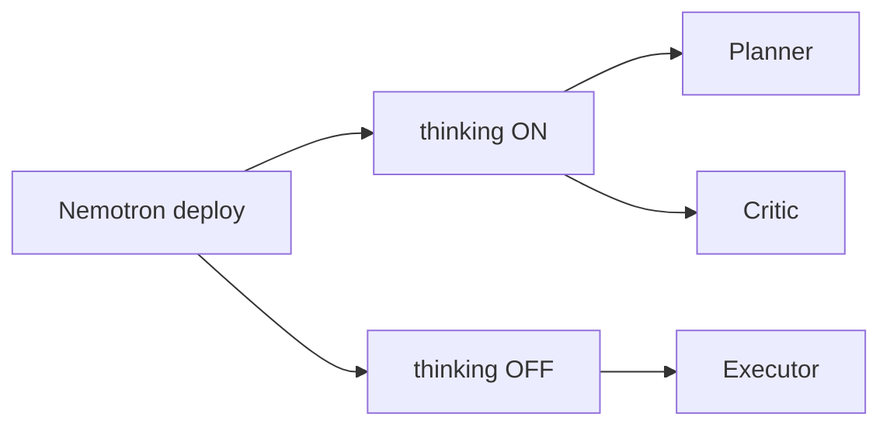

<!-- synced-from: platforms/nvidia-nim/NEMOTRON.md @ e971b4d7db4966aee9eaf92a9c497fc0935702fe -->

# NVIDIA NIM / Nemotron

NIM containers expose an OpenAI-compatible API, so all Anchor tooling works unchanged.

## The reasoning toggle

Llama-Nemotron models switch modes via a system-prompt line: `detailed thinking on` (deliberate reasoning — temp 0.6/top_p 0.95) or `detailed thinking off` (direct answers — greedy). The fleet client (`anchor_client.py`) applies this automatically for endpoints with `quirks: {think_toggle: nemotron, temperature: 0, sampling_thinking: {top_p: 0.95}}` — greedy when thinking is off, 0.6/0.95 when it's on.

## One model, three roles

This toggle gives you the orchestrator pattern on a single deployment — **thinking on = judgment**, **thinking off = keystrokes**:

| Role | Toggle | Addition to mythos-core |
|---|---|---|
| Planner | on | "Only output is a plan per the template; no implementation." |
| Executor | off | one task spec |
| Critic | on | "Review, don't fix; use the review template." |

Nemotron Super/Ultra with thinking on is the most credible local stand-in for a frontier planner/critic; Nano works as a spec executor. Don't leave thinking on for bulk execution — deliberate tokens are the local equivalent of credit burn.

*Local judgment and execution are a big part of the [Savings](../savings) story — please consider [donating](https://donate.stripe.com/28E6oHeq8fxQ5p7fmBdjO01) to help support this project.*

## Tracked plans

Same `.plans/` contract as other platforms: draft under `drafts/`, human promotes to ready, claim → `in-progress/`, finish → `completed/`. **Docs describe current state, not plans** — never write product docs from `.plans/` contents; document shipped code only.
