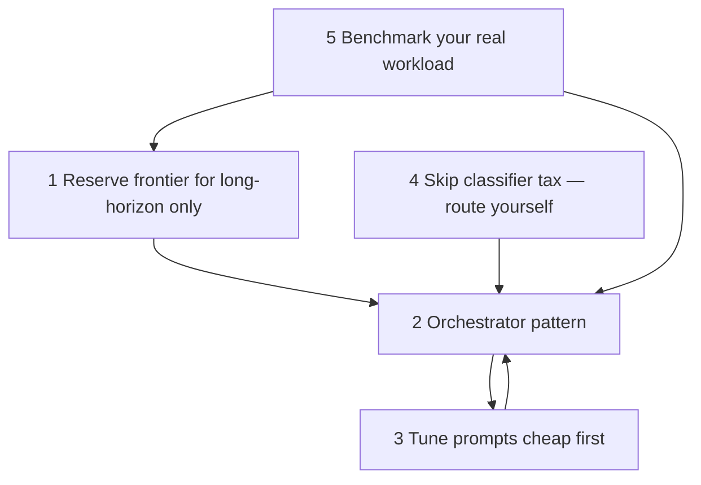
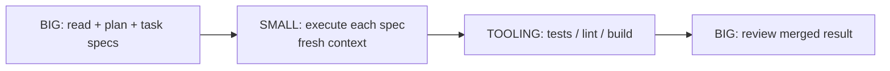
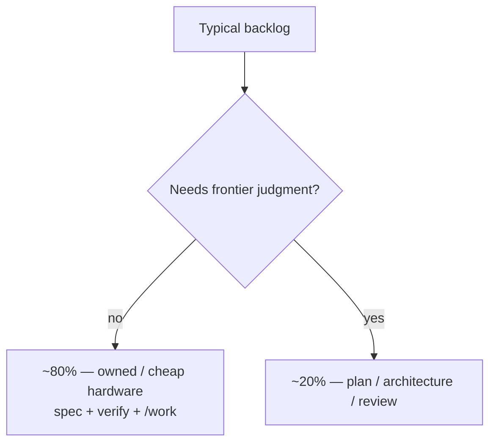

# The Playbook

The operator playbook for a credit-metered frontier model, generalized beyond any one vendor. The premise: frontier models are becoming **metered utilities**, so the operator skill is knowing which tasks deserve frontier pricing and routing everything else to models that are already good enough.

## The five moves

Pay frontier prices for **judgment**, not keystrokes. The five moves as a single operator loop:

**1. Reserve the frontier model for long-horizon work only.** Its edge is autonomy over hours, not intelligence per prompt. One-session, one-file tasks never touch it.

**2. Run the orchestrator pattern.** The expensive model touches the project **twice** — plan, then review — while cheap/local models do the keystrokes:

Commit ready plans under **`.plans/`** and start executors with [**`/work`**](/skills/work) (or `orchestrate.py --plan-file`) so handoff is file-based, not chat archaeology. Set a project **Preferred orchestrator** (`anchor --set-orchestrator …`); if unset, a frontier/near-frontier session may act as **temporary coordinator** (inventory plans, propose **Depends on**). For always-on hardware at several skill levels, use [**`/fleet-watch`**](/skills/fleet-watch) so each tier only claims fit-appropriate, **dependency-ready** plans—see [Fleet workers](/tooling/fleet-workers).

**3. Tune prompts on a cheap model first.** A sloppy prompt costs the same as a great one. Have a cheap model rewrite every task into a spec with acceptance criteria, files in scope, and a definition of done. Three attempts at a task is the silent budget killer; one tuned attempt is the fix. (`scripts/prompt_tuner.py`)

**4. Don't pay the classifier tax.** Security-adjacent work may get rerouted by safety classifiers anyway — route it yourself to the model you'd be rerouted to, and save the credits.

**5. Benchmark your real workload.** Don't take routing tables on faith — run your own tasks across your own tiers and let pass-rate and latency decide. (`scripts/benchmark.py`)

*The [Savings](/savings) sketches show how large that gap can get — please consider [donating](https://donate.stripe.com/28E6oHeq8fxQ5p7fmBdjO01) to help support this project.*

## Why this matters double for Anchor

The playbook's economics assume "cheap model" means Sonnet. Anchor pushes it further down: the same orchestration discipline lets a swarm of cheap, always-on workers do the keystrokes. And the discipline that saves money on frontier credits is *the same discipline* that makes small models reliable at all — small models don't fail because they lack knowledge for scoped tasks; they fail because nothing imposes process on them. Impose it, verify externally, and an 8B model executing a well-cut task spec is indistinguishable from a much bigger model on most of your backlog.

For a typical build, **~80% of the work never needed the big model**. Anchor exists to make that 80% run on hardware you own:

Turn that mix into **day / month / year dollar sketches** (solo → team → org) on the **[Savings](/savings)** page — with the unit model spelled out so you can plug in your own token rates. If those numbers look familiar, please consider [donating](https://donate.stripe.com/28E6oHeq8fxQ5p7fmBdjO01) to help support this project.
