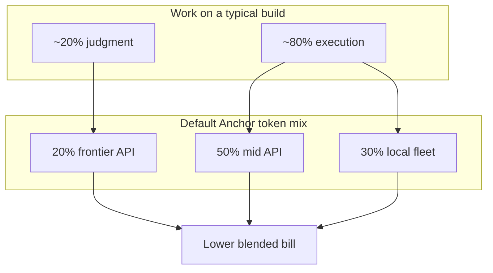
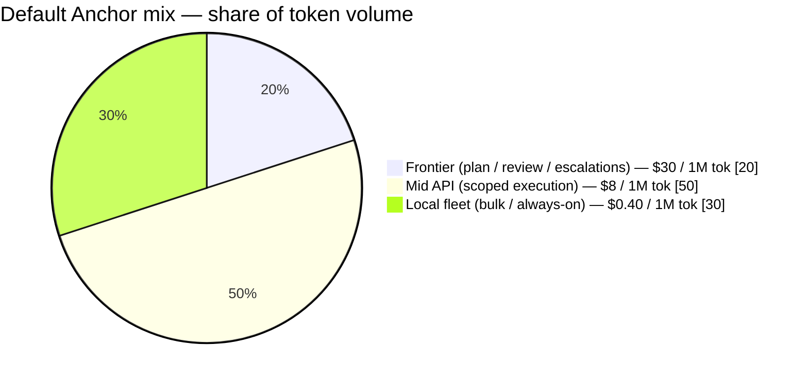
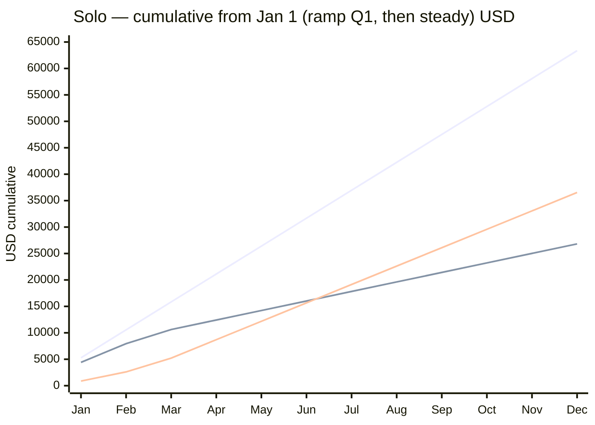
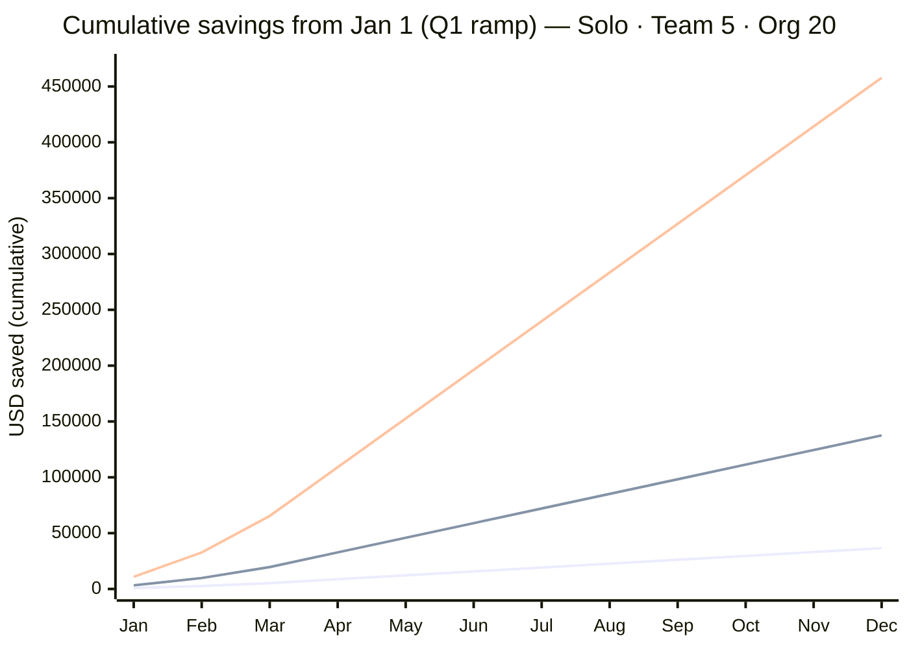
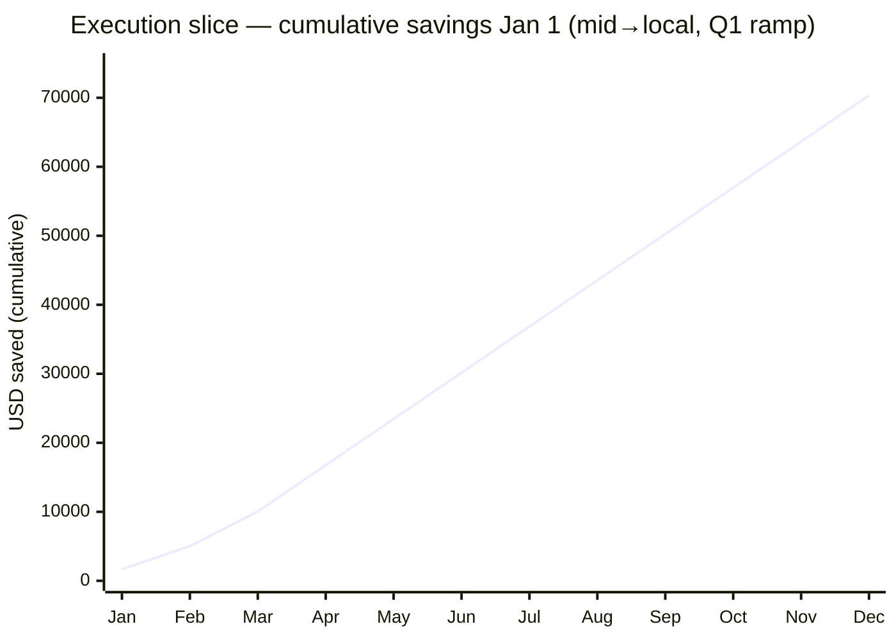
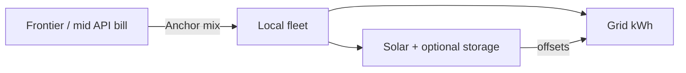
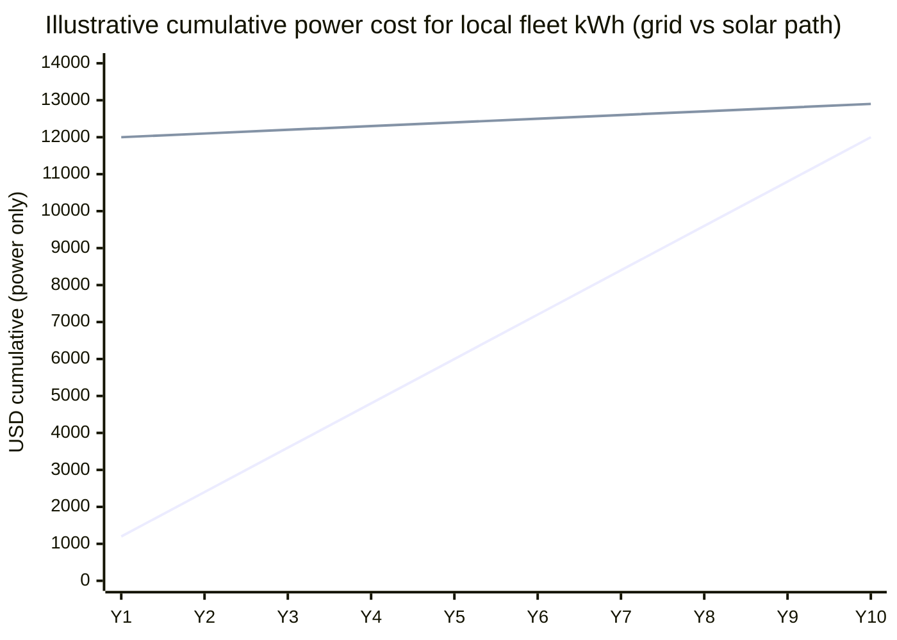
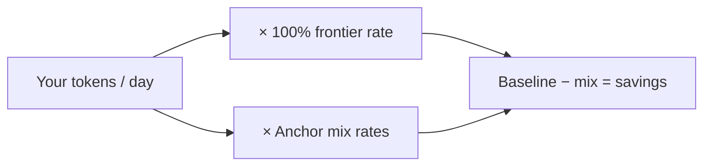

# Savings

**Anchor exists to cut inference spend** — not by making models dumber, but by stopping you from paying frontier prices for keystrokes.

Frontier models are excellent judges and poor economics for bulk edits, boilerplate, renames, and “try again” thrash. The [Playbook](/playbook) says ~80% of a typical build never needed the big model. Anchor makes that 80% run on mid-tier APIs or hardware you already own, with the same external discipline that keeps quality checkable.

*If this project is already helping your bill, a quiet [donation](https://donate.stripe.com/28E6oHeq8fxQ5p7fmBdjO01) helps keep the work going — no pressure.*

## The model in one picture

About **80%** of backlog work is execution (scoped edits, swarm steps); **~20%** is judgment (plan, review, hard bugs). Anchor maps that onto a cheaper **token mix** and keeps quality checkable (tooling verifies; two fails → escalate once).





**Baseline:** ~100% of agent tokens at frontier-class pricing (**$30 / 1M** blended, illustrative).  
**Anchor mix:** pie above (adjust to your stack). **Calendar:** 22 workdays / month · 12 months / year. Rates are order-of-magnitude, not a vendor quote.

| Cost driver | Without Anchor | With Anchor |
|-------------|----------------|-------------|
| Routine edits | Frontier / max plan | Mid or local task specs |
| Retries on sloppy prompts | 3× spend | Tune cheap first (`prompt_tuner`) |
| Wrong tier on whole backlog | Expensive agent grabs `small` work | Preferred models + `/work` fit skip |
| Re-planning in chat | Re-read repo on frontier | [`.plans/`](/skills/work); cheap executors pull |
| “Done” without checks | Silent rework | Tooling verifies |

*Saving something real? Please consider a small [donation to support Anchor](https://donate.stripe.com/28E6oHeq8fxQ5p7fmBdjO01).*

---

## First year after adoption (Jan 1 = day zero)

**Adoption day = 1 January.** Usage volume is steady, but **discipline is not instant**: scaffold, endpoints, first plans, and fleet wiring take a quarter. Monthly savings are scaled by a **ramp** (fraction of work under the Anchor mix):

| Month | Ramp | What’s typical |
|-------|------|----------------|
| **Jan** | **25%** | Scaffold, `/config`, first [`.plans/`](/skills/work) / [`/draft`](/skills/draft) |
| **Feb** | **50%** | Preferred models, mid/local endpoints, early `/work` |
| **Mar** | **75%** | Fleet timers / multi-tier habit |
| **Apr–Dec** | **100%** | Steady-state mix |

That month’s spend on the Anchor path is  
`frontier_rate × (1 − ramp) + mix_rate × ramp`  
so early months still look partly “all frontier.” Cumulative **savings** = sum of `ramp × full monthly gap`.

Steady-state monthly rates (after ramp):

| Scale | Tokens / workday | Frontier / mo | Anchor mix / mo | Full gap / mo |
|-------|------------------|---------------|-----------------|---------------|
| **Solo** | ~8M | $5,280 | $1,800 | **$3,480** |
| **Team of 5** | ~30M | $19,800 | $6,730 | **$13,100** |
| **Org of 20** | ~100M | $66,000 | $22,400 | **$43,600** |

What changes at steady state: solo → mid + laptop/Mac Mini for execution; team → shared plans + [fleet workers](/tooling/fleet-workers); org → H100/large mid for the 80%, frontier for architecture and final review.

### Solo builder — cumulative spend vs savings

<div className="chart-with-legend">



<div className="chart-key">
<p className="chart-key-title">Color key</p>
<table>
  <tbody>
    <tr>
      <td className="series-cell"><span className="swatch swatch-1" aria-hidden="true"></span>All-frontier spend</td>
      <td>Never adopt; full frontier bill every month</td>
    </tr>
    <tr>
      <td className="series-cell"><span className="swatch swatch-2" aria-hidden="true"></span>Anchor-path spend</td>
      <td>Ramped mix (partly frontier in Q1)</td>
    </tr>
    <tr>
      <td className="series-cell"><span className="swatch swatch-3" aria-hidden="true"></span>Cumulative savings</td>
      <td>Gap between the two spend lines</td>
    </tr>
  </tbody>
</table>
</div>

</div>

By **Dec** (with ramp): ~**$63k** spent without Anchor vs ~**$27k** on the adoption path → ~**$37k** kept (vs ~$42k if you were at 100% mix from day one).

### All scales — cumulative savings over 12 months

Same Q1 ramp, three org sizes:

<div className="chart-with-legend">



<div className="chart-key">
<p className="chart-key-title">Color key</p>
<table>
  <tbody>
    <tr>
      <td className="series-cell"><span className="swatch swatch-1" aria-hidden="true"></span>Solo</td>
      <td>~**$37k** by Dec</td>
    </tr>
    <tr>
      <td className="series-cell"><span className="swatch swatch-2" aria-hidden="true"></span>Team of 5</td>
      <td>~**$138k** by Dec</td>
    </tr>
    <tr>
      <td className="series-cell"><span className="swatch swatch-3" aria-hidden="true"></span>Org of 20</td>
      <td>~**$458k** by Dec</td>
    </tr>
  </tbody>
</table>
</div>

</div>

| Scale | Steady saved / day | End Q1 (Mar) | End H1 (Jun) | End year (Dec) |
|-------|--------------------|--------------|--------------|----------------|
| Solo | ~$158 at full ramp | ~$5.2k | ~$15.7k | **~$36.5k** |
| Team of 5 | ~$594 at full ramp | ~$19.7k | ~$59.0k | **~$138k** |
| Org of 20 | ~$1,980 at full ramp | ~$65.4k | ~$196k | **~$458k** |

Day ≈ full monthly gap ÷ 22 (after Apr). Scale linearly with **your** token volume and $/1M rates.

### Extra lever: move bulk execution off mid API

Always-on mid execution (~**40M tokens / workday** on that slice) → owned hardware, **same Q1 ramp**, frontier judgment unchanged. Full gap ~**$6,700 / mo** after April:

<div className="chart-with-legend">



<div className="chart-key">
<p className="chart-key-title">Color key</p>
<table>
  <tbody>
    <tr>
      <td className="series-cell"><span className="swatch swatch-1" aria-hidden="true"></span>Execution-slice savings</td>
      <td>Mid API → local only (not full org bill)</td>
    </tr>
  </tbody>
</table>
</div>

</div>

Hardware is capex or rent (Mac Mini → H100). Payback is often weeks to a few months once past ramp — run [fit_device](/tooling/scripts) and your power bill.

*If those curves look like money you get to keep, [supporting this project](https://donate.stripe.com/28E6oHeq8fxQ5p7fmBdjO01) is genuinely appreciated.*

---

## Solar: powering local compute

Once Anchor has moved a large slice of work **off API meters**, the residual cost of that slice is mostly **hardware amort + electricity**. Solar does not replace the orchestrator pattern — it attacks the **power line** of owned iron so always-on executors (Mac Minis, desktop towers, small GPU boxes, even denser fleets) run closer to pure amort.



### When solar is in scope

| More attractive | Less attractive |
|-----------------|-----------------|
| Always-on pullers ([`/fleet-watch`](/skills/fleet-watch), multi-box) | Sporadic laptop inference a few hours/week |
| High local utilization (daytime batch + night batch with battery or night grid) | Low duty cycle — panels sit idle with the GPUs |
| Expensive or rising grid $/kWh, peak demand charges | Very cheap industrial power already |
| Roof / ground / carport space, incentives, net metering | No siting rights, heavy HOA/landlord constraints |
| Multi-year ops horizon (5–15 years) | Need cash payback in &lt;12 months |

Rough power context (order-of-magnitude, duty-cycle dependent):

| Box | Continuous-ish draw (illustrative) | ~kWh / year if ~50% duty |
|-----|------------------------------------|---------------------------|
| Mac Mini / small NUC | ~20–60 W | ~90–260 kWh |
| Gaming / 4090-class tower | ~150–450 W average under mixed load | ~650–2,000 kWh |
| Dense multi-GPU node | hundreds of W to multi-kW | site-specific — measure |

Local token cost in the unit model (~**$0.40 / 1M tokens**) already bakes a little power + amort. Solar can **shrink the power share** of that number; it does not erase GPU purchase price.

### Capex vs power savings (illustrative)

**Not a quote.** Regional panels, labor, incentives, and irradiance dominate. Treat this as a worksheet skeleton.

| Item | Illustrative range |
|------|--------------------|
| Small residential / shop array (3–6 kW DC) | ~$6k–$18k after common incentives (highly regional) |
| Usable annual production (good sun, that size) | ~4,000–9,000 kWh / year |
| Grid retail rate (example) | ~$0.12–$0.35 / kWh |
| Avoided grid spend at $0.20/kWh × 6,000 kWh | ~**$1,200 / year** |
| Simple payback on $12k net system | ~**10 years** (before rate inflation / demand charges) |

For **compute-heavy** sites the avoided kWh is only the share the fleet actually draws — a single Mac Mini cannot “use” a whole 6 kW array; surplus usually needs **net metering, other loads, or storage**. Pairing solar with **always-on fleet workers** plus house/office baseload is usually more honest than “panels only for the GPU.”

**Stacking with Anchor (same spirit as the Jan 1 charts):**

1. **Year 0–1:** software mix (API → mid/local) — largest $/mo gap; short payback.  
2. **Year 1–N:** hardware amort of local boxes.  
3. **Year 3–15:** solar (and optional battery) — slower payback, **locks in** low marginal kWh for the local slice and hedges rate spikes.

<div className="chart-with-legend">



<div className="chart-key">
<p className="chart-key-title">Color key</p>
<table>
  <tbody>
    <tr>
      <td className="series-cell"><span className="swatch swatch-1" aria-hidden="true"></span>Grid-only power</td>
      <td>~$1,200 / year avoided-load example (no solar)</td>
    </tr>
    <tr>
      <td className="series-cell"><span className="swatch swatch-2" aria-hidden="true"></span>Solar path</td>
      <td>~$12k net system year 0, then ~$100 / year O&amp;M stand-in</td>
    </tr>
  </tbody>
</table>
</div>

</div>

*Crossing point ≈ simple payback (~year 10 in this sketch). Real systems often cross earlier with incentives, higher retail rates, or more kWh displaced — or later with poor sun / high install cost. Battery adds capex and resilience; model it separately.*

### Benefits vs costs (weigh before you buy)

| Benefits | Costs / risks |
|----------|----------------|
| Lower **marginal** cost per local token after payback | High **up-front** cash; multi-year horizon |
| Hedge against retail rate inflation and peak pricing | Install, permitting, interconnection delay |
| Aligns always-on fleet workers with daytime generation (or storage) | Intermittency without battery; night jobs still on grid |
| Can serve whole site (not just GPUs) — better capacity factor | Roof structure, shade, HOA, landlord, insurance |
| Narrative fit: own judgment **and** own electrons | Wrong-size array for tiny duty cycle → poor ROI |
| Optional ESG / resilience story for the shop | Inverters, O&amp;M, eventual panel degradation |

### Practical order of operations

1. Measure **actual** wall power for the boxes you will run 24/7 (kill-a-watt / PDU / UPS logs).  
2. Finish Anchor’s **API → local** move for fit work ([hardware](/hardware/personal-devices/mac-mini), [fleet workers](/tooling/fleet-workers)) so utilization is real.  
3. Size solar for **site loads** (fleet + office), not a fantasy GPU-only load factor.  
4. Run installer quotes + incentive calculators in **your** jurisdiction; re-do the cumulative chart with their kWh and net cost.  
5. Only then add battery if you need night-only local inference or backup — do not assume battery is free “for Anchor.”

Solar is a **second-order** savings lever: it matters most after local compute is already the right place for the 80%. It is not a substitute for Preferred models, `/work` fit, or prompt tuning.

*Owning the stack end-to-end? A [thank-you donation](https://donate.stripe.com/28E6oHeq8fxQ5p7fmBdjO01) helps us keep the docs and tooling free.*

---

## Worked arithmetic (solo day, steady-state)

Full-ramp month (Apr–Dec). Early months use `savings = ramp × $3,480` (Jan 25% … Mar 75%).

```text
Tokens/day          = 8,000,000
All frontier        = 8 × $30          = $240 / day

Anchor mix (100% ramp):
  20% frontier      = 1.6 × $30        = $48
  50% mid           = 4.0 × $8         = $32
  30% local         = 2.4 × $0.40      ≈ $1
  Total             ≈ $81 / day

Savings/day         ≈ $159
× 22 workdays       ≈ $3,480 / month (steady)
Year with Q1 ramp   ≈ $36.5k cumulative (not 12 × full month)
```



Swap in provider usage exports and real $/1M; the structure is the product, not the sample dollars.

*If the arithmetic works in your favor, please [help support Anchor](https://donate.stripe.com/28E6oHeq8fxQ5p7fmBdjO01) if you can.*

## What Anchor does *not* claim

- That local 8B models replace frontier judgment on greenfield architecture  
- That you will hit these exact dollars without measuring your own mix  
- That seat licenses (IDE, chat) disappear — this page is about **inference routing and thrash**  
- That solar is free or always ROI-positive — panels are multi-year infrastructure, not a software toggle  

Measure with [benchmark](/tooling/scripts), provider dashboards, and a real power meter; treat this as a **business case sketch**, then validate.

## Get the savings in practice

1. [Playbook](/playbook) — five moves (orchestrator pattern first)  
2. [Doctrine](/doctrine) — process that makes cheap models checkable  
3. [`/work` + `.plans/`](/skills/work) — path-authoritative backlog, Preferred models  
4. [`/fleet-watch`](/skills/fleet-watch) — durable multi-tier pullers  
5. [Hardware](/hardware/personal-devices/mac-mini) — own the 80% when volume justifies it  
6. **Solar** (above) — optional; lower kWh for always-on local fleet after utilization is real

---

Anchor is free open source. If the savings on this page are more than theoretical for you, please consider a [donation](https://donate.stripe.com/28E6oHeq8fxQ5p7fmBdjO01) — it funds continued work on the doctrine, fleet tooling, and docs. Source on [GitHub](https://github.com/carefreeinv/anchor); project by [Carefree Investments LLC](https://carefreeinv.com).
