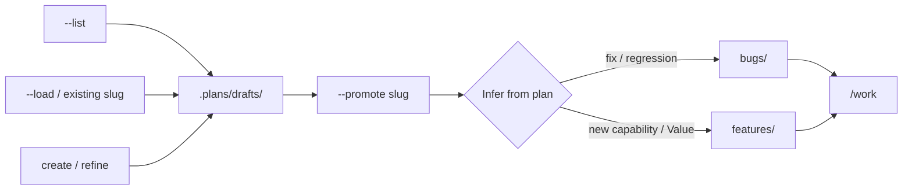

# `/draft`

**Best used:** any project with **`.plans/`** when you are **planning** (create,
list, load, promote) — not implementing. See [Skills overview](/skills/overview).

**Planning mode** for **`.plans/drafts/`**: create or refine drafts, **list** them, **load** an existing draft for discussion, and **promote** a draft to a ready lane when you ask. Same contract on every platform — only install paths and “no shell” adaptations differ.

Does **not** implement product code. Does **not** run [`/work`](/skills/work). Promotion is **only** via explicit promote args (not a side effect of create/load, and never from `/work` or fleet pullers).

## Usage

| Invocation | Behavior |
|------------|----------|
| `/draft` | Create from conversation goal → **`.plans/drafts/<slug>.local.md`** (private by default) |
| `/draft <topic…>` | Create; slug from topic (`.local.md` by default) |
| `/draft <slug>` | **File exists → load/discuss**; missing → create (`.local.md`) |
| `/draft --load <slug>` | Load existing draft for discussion (must exist) |
| `/draft --list` | List drafts (path, local?, Goal snippet) |
| `/draft --promote <slug>` | Move draft → **`bugs/` or `features/`** (agent **infers** lane); **keep basename** (incl. `.local.md`) |
| `/draft promote <slug>` | Same as `--promote` |
| `/draft --shared …` | Create/refine as a **tracked** `<slug>.md` (committable draft) |
| `/draft --local …` | Explicitly private `<slug>.local.md` (already the default) |

No `bugs` / `features` flag on promote — the plan body should decide.

## Target paths

```text
./.plans/drafts/          # create, list, load
./.plans/bugs/            # promote when plan is a bug fix
./.plans/features/        # promote when plan is a feature
```

| Flag | Create filename | Git |
|------|-----------------|-----|
| **(default)** | `<slug>.local.md` | Ignored via `.plans/.gitignore` — a fresh draft usually isn't ready to commit |
| `--shared` / `--tracked` | `<slug>.md` | Tracked (committable draft) |

**`.local` is sticky:** a plan that starts as `*.local.md` keeps that suffix on
promote and on later agent lane moves. Agents must **never** rename away `.local`.
Only a **human manual rename** (or creating with `--shared`) makes a plan
git-tracked.



## Modes

### List
Inventory `.plans/drafts/*` (skip `.gitkeep`). Show path, tracked vs local, Goal one-liner when available. Stop.

### Load / discuss
Read the full draft. Restate Goal, Preferred models, Depends on, Done when, and Steps outline. Discuss gaps; edit the draft only when asked. Stay under `drafts/`.

### Create / refine
Fill `.anchor/templates/plan.md` (Preferred models + Depends on after inventory). No `Lane:` / `Status:`. Path only under `drafts/`. For work a person must complete, set `- **Assignee:** <name|username|email>` (or `human`) — agents auto-skip claiming it but may still update status/comments; absent or `ai` = agent-eligible.

### Promote
User passes `--promote <slug>` (or `promote <slug>`). Agent reads the plan and chooses:

| Prefer **`bugs/`** | Prefer **`features/`** |
|--------------------|-------------------------|
| Fix, regression, crash, incorrect behavior | New capability, add / support / enable |
| Repair existing behavior | Header **Value:** high \| medium \| low |
| Defect language in Goal | Product surface expansion |

If still ambiguous, ask once (bug vs feature) — do not guess. Optional natural language (“as a bug”) overrides. Then `git mv` (preferred) into that lane with the **same basename** (keep `.local.md` if present). Refuse if the target basename already exists. Warn if Goal/Done when is thin or Depends on looks unmet. Do **not** auto-start `/work`. Report **from → to** and a one-line lane reason.

## Install (platform wiring)

| Platform | Install |
|----------|---------|
| **Claude Code** | `.claude/commands/draft.md` |
| **Grok Build** | `.grok/skills/draft/SKILL.md` |
| **Generic Chat** | `/draft` section in `CHAT.md` (human pastes / runs `git mv`) |
| **Local / NIM** | Same contract when the harness has shell |

## Related

- [**`/work`**](/skills/work) — execute after the plan is in a ready lane
- [**`/fleet-watch`**](/skills/fleet-watch) — durable pullers (ready lanes only)
- [Fleet workers](/tooling/fleet-workers)
- [Doctrine — tracked plans](/doctrine#tracked-plans-plans)
