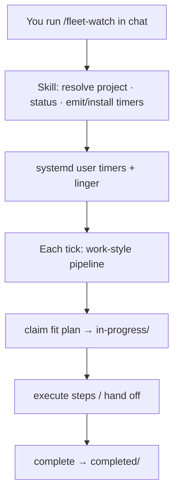

# `/fleet-watch`

**Best used:** configure **always-on** plan pullers for a project’s `.plans/`
(from the project, or from Anchor with a project name/path). See
[Skills overview](/skills/overview).

Turn on **always-on plan watchers** for a project so eligible work under **`.plans/`** is picked up and driven through the same kind of **claim → execute → complete** loop as [**`/work`**](/skills/work)—without you sitting in an interactive session.

You run the skill once (or occasionally) in a coding agent to **configure** those watchers. The watchers themselves then keep applying that work-style workflow on a schedule. Architecture of pull-per-endpoint fleets: [Fleet workers](/tooling/fleet-workers).

## Why use it

| Without `/fleet-watch` | With `/fleet-watch` |
|------------------------|---------------------|
| You must open a session and run `/work` for each plan | Watchers poll, claim fit-appropriate plans, and run the work loop unattended |
| Idle machines stay idle until someone remembers | Mid/small/reasoner workers keep watching after reboot |
| Handoff depends on chat history | File-based ready → in-progress → completed continues on its own |

Watchers **pull one plan per tick** (they do not drain the whole backlog by default and do not promote drafts). They still honor Preferred models / fit and do **not** replace a [preferred orchestrator](/tooling/cli#preferred-orchestrator-per-project) for architecture—lesser workers escalate hard planning.

## When to run it

- You have (or want) a project with a `.plans/` tree and ready work under `bugs/` / `features/`
- You want pollers that **survive reboot** (user-level timers + linger)
- You are in the project folder, **or** in the Anchor repo and want to target another project by name

Skip it if you only work plans interactively with `/work` and do not want background claimers.

## Usage

| Invocation | Behavior |
|------------|----------|
| `/fleet-watch` | Use **this** project (CWD has `.plans/`, or its git root does). Status + recommended durable setup |
| `/fleet-watch foo-project` | Target `./foo-project`, `../foo-project`, or another resolved path named `foo-project` |
| `/fleet-watch /abs/path/to/app` | Explicit project root |
| `/fleet-watch --status` | Inspect only (lanes, timers, linger)—no install |
| `/fleet-watch --install` | After status, **install** recommended user timers (agent asks for consent if not already clear) |
| `/fleet-watch --tiers mid,small` | Prefer those capability tiers when proposing/installing workers |

Everything after `/fleet-watch` is `$ARGUMENTS`. The skill resolves the project first, then runs the right helper under the hood—you should not need to memorize script paths.

### Project resolution (what the skill does)

1. If the first token looks like a path or project name → resolve it (absolute path, `./name`, sibling of CWD, or under a known workspace).
2. Else if **CWD** (or git root) contains `.plans/` → that is the project.
3. Else if CWD is the **Anchor** repo and a single obvious app path was not given → ask once, or accept `foo-project` as a sibling/child name.
4. Prefer absolute paths in any commands the agent runs.

## What “good” looks like after success

1. Project has `.plans/` with known lanes (including `in-progress/`).
2. At least one **systemd user timer** is enabled for that project (name like `anchor-watch-<project>-<agent>.timer`), **or** you accepted a printed install plan to enable yourself.
3. `loginctl` **linger** is on for your user so timers fire after reboot without an open login.
4. Each watcher has a **unique agent id** so claims under `in-progress/` do not collide.
5. You know how to check: “list my anchor-watch timers” / status via `/fleet-watch --status`.

## Skill session vs watcher workers

| | **`/fleet-watch` skill** (this chat) | **Watchers it installs** |
|--|--------------------------------------|---------------------------|
| Job | Resolve project, status, emit/install timers | On each tick: pick/claim a plan and run the work-style pipeline |
| Like `/work`? | No—you are *wiring* the fleet | **Yes in spirit**—claim → in-progress → execute (and complete when Done when holds) |
| When | You type `/fleet-watch` | Continuously (timers + linger) |

So: the skill does not step through a plan’s table in-session; the **workers it sets up** are how the work workflow runs in the background.

## What the skill will *not* do

- Promote drafts → ready (use [**`/draft --promote`**](/skills/draft); not this skill)
- Implement a plan’s steps **in this chat** (that is interactive [**`/work`**](/skills/work); background execution is what the **watchers** do after install)
- Install system-wide units under `/etc/systemd` unless you explicitly demand root installs
- Enable timers without consent when you only asked for status or a dry recommendation
- Replace `/work` as the interactive “work this plan with me now” command

## Install (platform wiring)

Same contract everywhere; only how the agent loads the skill differs:

| Platform | Install |
|----------|---------|
| **Claude Code** | Scaffold installs `.claude/commands/fleet-watch.md` |
| **Grok Build** | Scaffold installs `.grok/skills/fleet-watch/SKILL.md` |

## Related

- [**`/work`**](/skills/work) — interactive: pick and execute one plan *with you in the session*
- [Fleet workers](/tooling/fleet-workers) — multi-tier pull model, leases, isolation (what the watchers implement)
- [Utility scripts](/tooling/scripts) — `fleet_watch.py` / `work_once.py` if you automate outside an agent
- [CLI](/tooling/cli) — scaffold, preferred orchestrator
