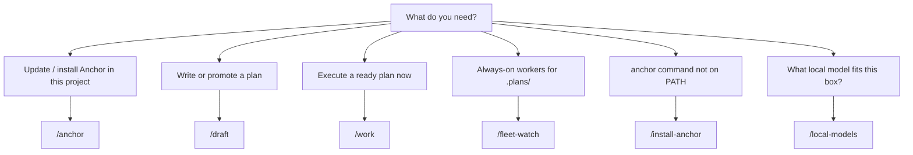

# Skills

Agent **slash commands** that implement Anchor process: plans, fleet watchers,
scaffold/upgrade, CLI install, and local-model fit. Same idea on Claude Code
and Grok Build; install paths differ.

## Where each skill is best used

| Skill | Best used | Default project / focus | Scaffolded? |
|-------|-----------|---------------------------|-------------|
| [**`/anchor`**](/skills/anchor) | **In a project:** keep this tree current. **In Anchor:** scaffold/reconfigure **another** project (path required). | Project: CWD/git root. Anchor base: explicit path. | Scaffolded: yes (`claude`/`grok`). Anchor: base skill only. |
| [**`/draft`**](/skills/draft) | Any project with **`.plans/`** when you are **planning**, not implementing. | Current repo’s `.plans/drafts/` | Yes (dual-use base + scaffold) |
| [**`/work`**](/skills/work) | Any project with ready plans under **`.plans/bugs/`** or **`features/`** when you want interactive **execution**. | Current repo’s `.plans/` | Yes |
| [**`/fleet-watch`**](/skills/fleet-watch) | Turn on **background** pullers for a project’s `.plans/` (often from Anchor CWD with a sibling name, or from the project itself). | CWD if it has `.plans/`, else named path / `../app` | Yes |
| [**`/install-anchor`**](/skills/install-anchor) | Anywhere `anchor` is missing or broken on **PATH** (first machine setup or new shell). | Locates Anchor checkout; not project-specific | Yes |
| [**`/local-models`**](/skills/local-models) | **Inside a project** when choosing/installing a **lean local** executor for this machine. | This host + optional reconfigure draft for **this** project | Scaffolded only (`platforms/…`) |

### Quick chooser

## Related (not separate Skills pages)

| Command | Best used | Notes |
|---------|-----------|--------|
| **`/commit-prep`** | Before **any** `git commit` in Anchor-using projects | Scaffolded into every project. Prep only (tests, CHANGELOG, blog-if-warranted); does not commit. Project-agnostic — discovers this repo's CI, changelog, and blog conventions. See platform docs. |
| **`/config`** | From the **Anchor** checkout (or with Anchor checkout available) | Saves global platform/fleet/model-priority defaults via `config.sh`. |

## Packaging reminder

| Kind | Examples | Lives in |
|------|----------|----------|
| **Dual-use** (Anchor base **and** scaffolded into projects) | `/draft`, `/work`, `/commit-prep`, `/fleet-watch`, `/install-anchor` | Anchor `.grok/skills` / `.claude/commands` (and scaffolded copies) |
| **Scaffolded into projects** (source under `platforms/`) | `/local-models`, project `/anchor` | `platforms/claude-code/…`, `platforms/grok-build/…` |
| **Anchor base only** (path-required `/anchor`) | Anchor `/anchor` | Anchor checkout base skills — not the project CWD-default variant |

CLI reference for scaffold/upgrade without an agent: [The `anchor` CLI](/tooling/cli).
