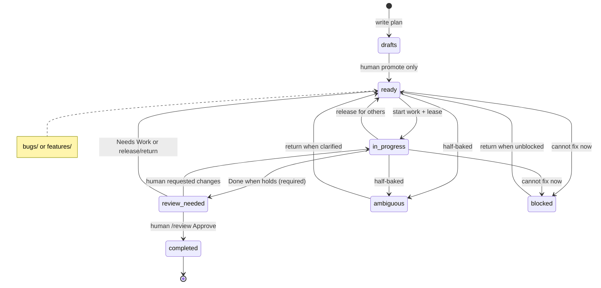
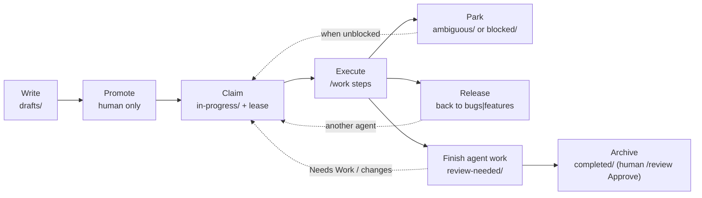

# `/work`

**Best used:** interactive **execution** of ready plans under `.plans/bugs/` or
`.plans/features/` in the current project. See [Skills overview](/skills/overview).

Execute the next (or named) ready plan from **`.plans/`**. Same contract on every platform — only install paths and “no shell” adaptations differ.

To **create** a plan first, use [**`/draft`**](/skills/draft) (writes under `.plans/drafts/`; optional `--local`).

Plans are git-tracked markdown under the **`.plans/`** dotdir. Do not gitignore the whole tree (scaffold ignores only `*.local.md`). Many UIs hide dotfolders — use the explicit path.

**Path is authoritative.** Lane and lifecycle come only from the directory a plan file sits in. Do not put `Lane:` or `Status:` inside plan markdown; ignore them if present.

## Usage

| Invocation | Behavior |
|------------|----------|
| `/work` | Resume **your** `in-progress/` work if any; else pick highest-priority **model-fit** ready plan |
| `/work --list` | List ready plans + your in-progress (Preferred models + fit); **do not** implement |
| `/work --no-fit-check` | Same priority as bare `/work`, skip model-fit filtering (still **one** plan) |
| `/work --no-fit-check <slug>` | Execute that plan even if Preferred models say otherwise |
| `/work <slug>` | Match `slug.md` or `slug.local.md` under ready lanes or **your** in-progress |
| `/work .plans/features/foo.md` | Execute that path if ready (or your own in-progress) |

## Lanes

| Path | Meaning | Execute? |
|------|---------|----------|
| `.plans/bugs/` | ready bug work | **yes** (highest priority) → then move to `in-progress/` |
| `.plans/features/` | ready feature work | **yes** (after bugs) → then move to `in-progress/` |
| `.plans/in-progress/` | claimed / being worked | **only if you moved it there** — others **ignore** |
| `.plans/ambiguous/` | half-baked / needs clarification | **no** (agent may park here) |
| `.plans/blocked/` | cannot proceed | **no** (agent may park here) |
| `.plans/review-needed/` | agent believes `Done when` holds, awaiting human sign-off | **no** (human [**`/review`**](/skills/review): Approve merges feature→dev then → `completed/`; empty queue may Promote dev→main) |
| `.plans/drafts/` | not ready | **no** (edit only) |
| `.plans/completed/` | finished archive | **no** |

**Never** implement from `drafts/`, `completed/`, `ambiguous/`, `blocked/`, or `review-needed/`. **Ignore** every `in-progress/` plan you did not claim.

### Agent move rule (hard)



Agents must **never** promote drafts except via [**`/draft --promote`**](/skills/draft), move work into `drafts/`, move **`in-progress/` → `completed/`** (always finish to `review-needed/`), move `review-needed/` → `completed/` except under human-confirmed [**`/review` Approve**](/skills/review), or touch another agent’s `in-progress/` plan. **Preserve basename** on every lane move (including `.local.md`); only a human may rename for privacy/tracking.

## Priority (bare `/work`)

Ready lanes only — bare `/work` never scans `in-progress/` (resume is an explicit named target you own).

1. All of `.plans/bugs/*.md` before any feature
2. Then `.plans/features/*.md` by header `Value: high | medium | low` (default medium)
3. Among ready plans, keep only **model-fit** plans — unless `--no-fit-check` or the user names a plan
5. **Skip plans with unmet `Depends on`** (dependency still open / not completed). Report blockers; do not start them.
6. Skip `drafts/`, `completed/`, `ambiguous/`, `blocked/`, `review-needed/`, foreign `in-progress/`, and `README.md`

## Model fit

Plan headers SHOULD include **Preferred models** (tiers `small | mid | reasoner | frontier` and/or concrete names). Bare `/work` skips plans that are a poor fit for the current model (overqualified or underqualified). Named slug/path or `--no-fit-check` overrides the skip; still state fit in one line when mismatched. See [model fitness](/model-fitness) and the [plan template](https://github.com/carefreeinv/anchor/blob/main/anchor/templates/plan.md).

**Know yourself:** model name + catalog tier (name/table win — e.g. Grok 4.5 is **mid**), cost posture (reasoning effort / thinking toggle), and cheaper capacity on this host.

**Cheaper capacity probe:** before hard-skipping overqualified work or burning a high-cost session on `small`/`mid` Preferred, check `scripts/endpoints.yaml` (and product-local / conventions models) for a lesser **reachable** executor. Registry map: `swarm`→`small`, `executor`|`executor-heavy`|`detached`→`mid`. If one fits, leave the plan unclaimed and print a dispatch line (`work_once.py --once --endpoint …`). If none are up, you are the available executor — do not permanent-refuse mid work.

**Same-model effort right-size:** when no cheaper worker exists, emit a pasteable command for the plan’s Preferred tier (`small`/`mid` → low/medium effort; `reasoner`+ → high). Examples: Grok Build **`/effort low`** or CLI **`--effort low`**; Nemotron/Qwen3 thinking off for bulk execute. High effort on a mid-class model is a **cost dial**, not a tier promotion — good-fit mid plans stay eligible. True overqualified + no cheaper worker → suggest `/work --no-fit-check` and the effort command; underqualified still skips.

**Let the script decide fit:** `python scripts/plan_fit.py --tier <yours> [--effort <current>]` prints one `take:`/`skip:` line per ready plan with the reason, plus an effort note when the dial is wrong for that plan's tier (`--endpoint` for fleet workers, `--json` for tooling). Read-only — claim with `plan_select.py --next --claim`. Its verdicts are the fit rules; a session that disagrees with it is wrong. See [scripts](/tooling/scripts).

**Refusals are terse.** A poor-fit skip is a one-line verdict (`skip: features/<slug> — underqualified (Preferred: reasoner; you: Sonnet 5/mid)`) plus at most two `→` lines — the dispatch command or model to escalate to, and `/work --no-fit-check <slug>`. The capacity probe shows up only as the target in that `→` line; narrating what was checked and what was unreachable is noise. No restated Goal, no re-derived fit rules, and no `## Result` footer on a turn that did no work.

**Do not under-rate yourself:** only the **tiers** a plan lists set the floor. Stronger product *names* alongside a tier you match are extra good-fit hits, not a raised bar; a names-only list you miss — or no **Preferred models** line at all — is **unknown** fit, which is eligible after a one-line fit note. Difficulty found *after* claiming is a per-step **Route to** / escalation-trigger decision, not grounds to refuse the claim. An unnecessary skip stalls the backlog exactly the way a wasteful frontier pickup burns credits.

**Depends on:** comma-separated other plan slugs (or `none`). A dependency is **met** when that slug is under `completed/` (or git history shows it was under `completed/`) and is **not** still open in another lane. Coordinators/planners should inventory existing plans when drafting and fill this field. Executors must not start work with unmet dependencies.

**Assignee (human-owned plans):** an optional `- **Assignee:**` header names who owns *completion*, separate from **Preferred models** (which model *executes*). It defaults to **ai** — absent, `ai`, `agent`, or `unassigned` means any agent may claim it. A person's name, username, email, or `human` means a person completes it: `/work`, `plan_fit.py`, `work_once.py`, and the coordinator MCP all **auto-skip** claiming it, whatever its fit. Agents may still read it and edit its body (status/comments) and commit that — only claiming/completing it (`in-progress/` / `review-needed/` / `completed/`) is reserved. `work_once.py --allow-assigned` forces a named claim when an operator wants an agent to take it anyway.

## Lifecycle



Mid-session stop: leave the file in **`in-progress/`** with a short `## Progress` note. Other agents must ignore it. Half-baked → `ambiguous/`; stuck → `blocked/` or return to ready. When Done when holds → **always** `review-needed/`; the human then runs [**`/review`**](/skills/review) (AI critic + survey) to **Approve** (merges `feature/<slug>` → dev, then → `completed/`), Needs Work → `bugs|features/`, or Skip. Agents never archive to `completed/` or merge from `/work`.

## Install (platform wiring)

The behavior above is identical everywhere. Only how the agent loads the skill differs:

| Platform | Install |
|----------|---------|
| **Claude Code** | Scaffold installs `.claude/commands/work.md` |
| **Grok Build** | Scaffold installs `.grok/skills/work/SKILL.md` |
| **Generic Chat** | No command file — follow the no-shell adaptation below (and in `CHAT.md`) |
| **Local / NIM** | Same contract when the harness has shell; headless: `work_once.py` / `orchestrate.py --plan-file` |

Scaffold always creates the empty `.plans/` tree + README. Process contract also lives in `.plans/README.md` once scaffolded.

### Chat / no shell

When the user types `/work` without tool access: ask them to `ls .plans/bugs .plans/features .plans/in-progress` and paste output; pick by the same priority and model-fit rules; dictate `git mv` into `in-progress/` when starting and into **`review-needed/`** when Done when holds. Never dictate a promote move, an `in-progress/` → `completed/` move, or a `review-needed/` → `completed/` move (use [**`/review`**](/skills/review)). Never work a foreign in-progress path.

### Headless / fleet

Interactive `/work` stays one-plan-per-invocation (not a daemon). For always-on or multi-tier workers that **pull** work, see the full guide: **[Multi-agent fleet workers](/tooling/fleet-workers)** (cron/systemd, capability tiers, leases, git isolation).

```bash
python scripts/work_once.py --list --tier mid --agent-id worker-1
python scripts/work_once.py --once --tier mid --agent-id worker-1   # moves → in-progress/
python scripts/work_once.py --once --endpoint h100-executor --run
```

Shared rules with `/work`: ready lanes only (never bare-pick in-progress), bugs before features, Value order, Preferred models fit, refuse `drafts/`/`completed/`, never promote, **ignore foreign in-progress** (owned via a required lease; no silent reclaim). Selection logic: `scripts/plan_select.py` + `plan_lease.py`. Small models: `plan_select.py --next [--claim]`.

### Git branches + commits + worktrees

When the project uses Git and work needs a branch:

1. **Parallel agents:** do **not** share one checkout. Prefer a **worktree per agent**:
   ```bash
   python scripts/worktree_for_agent.py ensure --project . --agent-id <id> --slug <plan-slug>
   # or: work_once.py … --ensure-worktree
   ```
   Edit only under the printed `WORKTREE=` path.
2. Integration branch: **`dev`**, else **`develop`**. **If neither exists, create `dev` from `main` (else `master`)** (the ensure helper does this).
3. Feature branch `feature/<slug>` inside that worktree; **`/work` never merges**
   to dev/main (human [**`/review` Approve**](/skills/review) merges feature → dev;
   empty-queue **Promote** merges dev → main).
4. When plan work is complete: run **`/commit-prep`** (prep only). If gates are
   **green**, stage + commit on the feature branch; optional push of that branch
   only — never merge from `/work`.

See [Fleet workers — isolation](/tooling/fleet-workers#4-isolation-git-multi-writer).

## Related

- [Multi-agent fleet workers](/tooling/fleet-workers) — architecture for multi-tier pull
- [`/fleet-watch`](/skills/fleet-watch) — install durable timers for a project
- [MCP servers](/tooling/mcp-servers) — **project-orchestrator** exposes list/claim/complete for a bound project without shell
- [Doctrine — tracked plans](/doctrine)
- [Playbook — orchestrator pattern](/playbook)
- [Platforms](/platforms/claude-code) — install and model-specific notes
- Source skill: `.grok/skills/work/SKILL.md` / `.claude/commands/work.md` in the [Anchor repo](https://github.com/carefreeinv/anchor)
