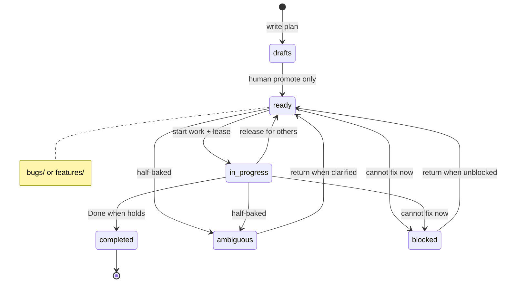
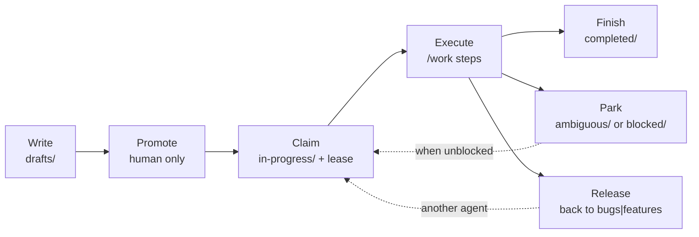

# `/work`

Execute the next (or named) ready plan from **`.plans/`**. Same contract on every platform — only install paths and “no shell” adaptations differ.

To **create** a plan first, use [**`/draft`**](draft) (writes under `.plans/drafts/`; optional `--local`).

Plans are git-tracked markdown under the **`.plans/`** dotdir. Do not gitignore the whole tree (scaffold ignores only `*.local.md`). Many UIs hide dotfolders — use the explicit path.

**Path is authoritative.** Lane and lifecycle come only from the directory a plan file sits in. Do not put `Lane:` or `Status:` inside plan markdown; ignore them if present.

## Usage

| Invocation | Behavior |
|------------|----------|
| `/work` | Resume **your** `in-progress/` work if any; else pick highest-priority **model-fit** ready plan |
| `/work --list` | List ready plans + your in-progress (Preferred models + fit); **do not** implement |
| `/work --no-fit-check` | Same priority as bare `/work`, skip model-fit filtering (still **one** plan) |
| `/work --no-fit-check <slug>` | Execute that plan even if Preferred models say otherwise |
| `/work <slug>` | Match `slug.md` or `slug.local.md` under ready lanes or **your** in-progress |
| `/work .plans/features/foo.md` | Execute that path if ready (or your own in-progress) |

## Lanes

| Path | Meaning | Execute? |
|------|---------|----------|
| `.plans/bugs/` | ready bug work | **yes** (highest priority) → then move to `in-progress/` |
| `.plans/features/` | ready feature work | **yes** (after bugs) → then move to `in-progress/` |
| `.plans/in-progress/` | claimed / being worked | **only if you moved it there** — others **ignore** |
| `.plans/ambiguous/` | half-baked / needs clarification | **no** (agent may park here) |
| `.plans/blocked/` | cannot proceed | **no** (agent may park here) |
| `.plans/drafts/` | not ready | **no** (edit only) |
| `.plans/completed/` | finished archive | **no** |

**Never** implement from `drafts/`, `completed/`, `ambiguous/`, or `blocked/`. **Ignore** every `in-progress/` plan you did not claim.

### Agent move rule (hard)



Agents must **never** promote drafts (use [**`/draft --promote`**](draft)), move work into `drafts/`, or touch another agent’s `in-progress/` plan.

## Priority (bare `/work`)

1. **Your** plans under `.plans/in-progress/` (resume)
2. All of `.plans/bugs/*.md` before any feature
3. Then `.plans/features/*.md` by header `Value: high | medium | low` (default medium)
4. Among ready plans, keep only **model-fit** plans — unless `--no-fit-check` or the user names a plan
5. **Skip plans with unmet `Depends on`** (dependency still open / not completed). Report blockers; do not start them.
6. Skip `drafts/`, `completed/`, `ambiguous/`, `blocked/`, foreign `in-progress/`, and `README.md`

## Model fit

Plan headers SHOULD include **Preferred models** (tiers `small | mid | reasoner | frontier` and/or concrete names). Bare `/work` skips plans that are a poor fit for the current model (overqualified or underqualified). Named slug/path or `--no-fit-check` overrides the skip; still state fit in one line when mismatched. See [model fitness](../model-fitness) and the [plan template](https://github.com/carefreeinv/anchor/blob/main/anchor/templates/plan.md).

**Depends on:** comma-separated other plan slugs (or `none`). A dependency is **met** when that slug is under `completed/` (or git history shows it was under `completed/`) and is **not** still open in another lane. Coordinators/planners should inventory existing plans when drafting and fill this field. Executors must not start work with unmet dependencies.

## Lifecycle



Mid-session stop: leave the file in **`in-progress/`** with a short `## Progress` note. Other agents must ignore it. Half-baked → `ambiguous/`; stuck → `blocked/` or return to ready.

## Install (platform wiring)

The behavior above is identical everywhere. Only how the agent loads the skill differs:

| Platform | Install |
|----------|---------|
| **Claude Code** | Scaffold installs `.claude/commands/work.md` |
| **Grok Build** | Scaffold installs `.grok/skills/work/SKILL.md` (or use `platforms/grok-build/commands/work.md`) |
| **Generic Chat** | No command file — follow the no-shell adaptation below (and in `CHAT.md`) |
| **Local / NIM** | Same contract when the harness has shell; headless: `work_once.py` / `orchestrate.py --plan-file` |

Scaffold always creates the empty `.plans/` tree + README. Process contract also lives in `.plans/README.md` once scaffolded.

### Chat / no shell

When the user types `/work` without tool access: ask them to `ls .plans/bugs .plans/features .plans/in-progress` and paste output; pick by the same priority and model-fit rules; dictate `git mv` into `in-progress/` when starting and into `completed/` when Done when holds. Never dictate a promote move. Never work a foreign in-progress path.

### Headless / fleet

Interactive `/work` stays one-plan-per-invocation (not a daemon). For always-on or multi-tier workers that **pull** work, see the full guide: **[Multi-agent fleet workers](../tooling/fleet-workers)** (cron/systemd, capability tiers, leases, git isolation).

```bash
python scripts/work_once.py --list --tier mid --agent-id worker-1
python scripts/work_once.py --once --tier mid --agent-id worker-1   # moves → in-progress/
python scripts/work_once.py --once --endpoint h100-executor --run
```

Shared rules with `/work`: resume own in-progress, bugs before features, Value order, Preferred models fit, refuse `drafts/`/`completed/`, never promote, **ignore foreign in-progress**. Selection logic: `scripts/plan_select.py` + `plan_lease.py`.

## Related

- [Multi-agent fleet workers](../tooling/fleet-workers) — architecture for multi-tier pull
- [`/fleet-watch`](fleet-watch) — install durable timers for a project
- [MCP servers](../tooling/mcp-servers) — **project-orchestrator** exposes list/claim/complete for a bound project without shell
- [Doctrine — tracked plans](../doctrine)
- [Playbook — orchestrator pattern](../playbook)
- [Platforms](../platforms/claude-code) — install and model-specific notes
- Source skill: `.grok/skills/work/SKILL.md` / `.claude/commands/work.md` in the [Anchor repo](https://github.com/carefreeinv/anchor)
