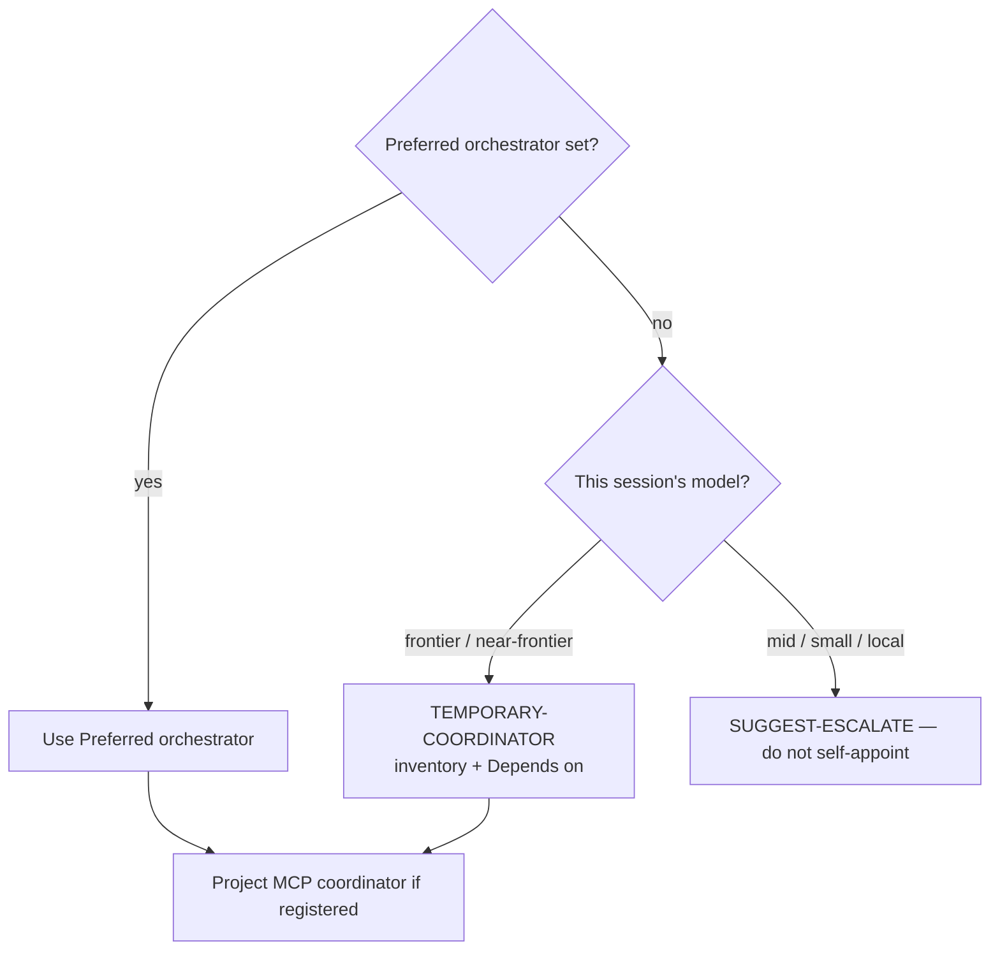

# The `anchor` CLI

`scripts/anchor.py` (run as `bin/anchor`, or `anchor` once installed) scaffolds a project with Anchor doctrine for whichever model platform(s) you're targeting. It never overwrites: any destination file that already exists is reported as a conflict and nothing is written, so you can resolve it and re-run.

**Hard rule (all projects):** docs describe **current shipped state**, not plan backlog. Never document the **contents** of `.plans/` as product docs or roadmap; when plan work ships, document the code. Documenting the `.plans/` **workflow** is fine when it is a shipped feature. See doctrine and mythos-core rule 12.

## Install

**Easiest:** run [**`/install-anchor`**](/skills/install-anchor) in a coding agent
session (Grok skill or Claude command). It detects OS/shell, finds the Anchor
checkout, and safely symlinks `bin/anchor` into `~/.local/bin` (no sudo; confirms
before writing).

Manual options (same script):

- **Symlink (preferred):** `mkdir -p ~/.local/bin && ln -sfn "$(pwd)/bin/anchor" ~/.local/bin/anchor` (ensure `~/.local/bin` is on `PATH`), or call `python3 scripts/anchor.py` directly.
- **`pip install -e .`** (or `pipx install .`) from the repo root gives a console-script `anchor`. This only installs the scaffolder — the fleet scripts (`orchestrate.py`, `router.py`, ...) stay copy-paste by design, since they're meant to be dropped standalone into other repos.

## Set defaults (optional)

`./config.sh` (or `/config` in Claude Code / Grok Build) asks which platform(s), fleet tooling, default language/framework, **model priority**, and **preferred orchestrator** you want, and saves the answer to `~/.config/anchor/defaults` (override with `$ANCHOR_CONFIG_DIR`). With saved defaults, `anchor` (in the project folder) or `anchor <project-dir>` scaffolds without any flags. Re-run `./config.sh` any time to change your mind, or `./config.sh --show` to print what's saved.

```bash
./config.sh --platform claude,grok --fleet --language node \
  --model-priority nim,claude:sonnet,claude:opus \
  --orchestrator claude:opus
```

## Preferred orchestrator (per project)

Who should **plan multi-step work and coordinate** for this project (including cross-plan **Depends on** analysis). Written into **`.anchor/conventions.md`** so lesser models recommend it instead of attempting orchestration themselves.

```bash
# Trivial: existing project (no full re-scaffold); omit the path to use cwd
anchor --set-orchestrator claude:opus
anchor <project-dir> --set-orchestrator claude:opus

# At scaffold time
anchor --platform claude,local:qwen3 --orchestrator claude:opus
anchor <project-dir> --platform claude,local:qwen3 --orchestrator claude:opus

# Or hand-edit the bold line in .anchor/conventions.md:
# **Preferred orchestrator:** `claude:opus`
```



**If unset:** a **frontier or near-frontier** model in the current session may act as a **temporary coordinator** (inventory `.plans/**`, propose dependencies, draft under `drafts/`). It should announce `TEMPORARY-COORDINATOR: <name> — Preferred orchestrator unset` and still recommend setting a durable orchestrator. Mid/small/local models must escalate rather than self-appoint. A project MCP coordinator, when registered, is the durable machine-side coordinator; the dashboard monitors those servers only.

## Scaffold a project

```bash
cd my-app && anchor                                      # scaffold the current directory
anchor <project-dir>                                     # or pass an explicit path
anchor <project-dir> --platform claude,grok               # platforms without survey
anchor <project-dir> --platform local:qwen3,local:gemma3 --fleet
anchor --framework rust                                    # skip framework detection/prompt (cwd)
anchor --orchestrator claude:opus                          # preferred planner/coordinator (cwd)
anchor --list                                               # show platform keys
anchor --platform claude --dry-run                          # preview findings only
anchor --platform claude --yes                              # write without confirmation prompt
```

Platform keys: `claude`, `grok`, `nemotron`, `local:<model>` (`qwen3`, `gemma3`, `mistral-small`, `deepseek-r1-distill`, `llama33`), `chat`. Add `--fleet` to also copy orchestrator/fleet tooling under **`.anchor/scripts/`** and **`.anchor/mcp/`** (never project-root `scripts/` or `mcp/`).

**Scaffold layout:**

| Kind | Project path |
|------|----------------|
| Doctrine | `.anchor/ANCHOR.md`, `.anchor/templates/…`, … |
| Conventions | **`.anchor/conventions.md`** (not project root) |
| Fleet (with `--fleet`) | `.anchor/scripts/…`, `.anchor/mcp/…` |
| Plans | project-root **`.plans/`** (unchanged) |
| Manifest | `.anchor-manifest.json` |

Source of doctrine/fleet in *this* repo remains top-level `anchor/`, `scripts/`, `mcp/`.

When there are **no overwrite conflicts**, the CLI prints **draft findings** (target, framework, platforms, fleet, orchestrator, model priority, file list) and a **recommended action**, then asks `Proceed with this plan? [y/N]` before writing anything. Pass `--yes` / `-y` to skip the prompt (required for non-interactive terminals). `--dry-run` prints the same findings and exits without writing. Conflicts still abort with nothing written and no prompt.

Every run also detects the target project's language/framework from marker files (`composer.json`, `package.json`, `Cargo.toml`, `go.mod`, ...) and writes idiomatic-composition guidance to **`.anchor/conventions.md`** (including Preferred orchestrator, **temporary coordinator** fallback for frontier sessions when unset, and lesser-model deferral). When `package.json` coexists with a backend marker (e.g. `composer.json` on a Drupal/Laravel tree), the non-node language wins — root Node files are often frontend/test tooling. Pass `--framework` to override. If detection fails and the terminal is interactive, it asks — proposing your saved language default, if any.

## Agent-assisted scaffold (`/anchor`)

Two skill variants share the slash name (see [**/anchor** skill page](/skills/anchor)):

| Variant | Default project | Source |
|---------|-----------------|--------|
| **Project scaffold** (`--platform claude` / `grok`) | **Current tree** (CWD / git root) | `platforms/…/anchor` → `.grok/skills/anchor` / `.claude/commands/anchor.md` |
| **Anchor base** | **Path required** (another project) | Anchor `.grok/skills/anchor` / `.claude/commands/anchor.md` |

Both locate a local Anchor checkout, dry-run first, classify conflicts with existing agent config (`CLAUDE.md`, `.claude/`, `GROK.md`, …), and propose **merge / backup / skip**. Already-scaffolded trees use `--check` / `--diff` / `--upgrade`. In a project, `/anchor` with no path means “update **this** project.”

## Check, diff, and upgrade

Every scaffold writes `.anchor-manifest.json`, recording the anchor commit, platforms, and file hashes used. Use these modes on a project that **already** has a manifest:

```bash
anchor --check                         # short status per managed file (no writes)
anchor --diff                          # status + unified diffs (no writes)
anchor --upgrade                       # preview plan, confirm, apply
anchor --upgrade --yes                 # non-interactive: safe applies only
anchor --upgrade --yes --force         # also overwrite locally modified managed files
anchor --upgrade --dry-run             # print plan only
anchor --update …                      # alias for --upgrade
```

| State | Meaning | `--upgrade --yes` |
|-------|---------|-------------------|
| unchanged | project == manifest == (or no) upstream change | skip |
| upstream updated | project still matches scaffold-time hash; source moved on | **take** upstream |
| locally modified | project hash ≠ manifest | **keep** (unless `--force`) |
| MISSING | managed file deleted | **restore** |
| new | current scaffold would add; not in manifest; path free | **add** |
| layout | legacy `anchor/…` doctrine → `.anchor/…` | **move** |

Locally modified files are never overwritten without `--force`. Unmanifested user files are never claimed. After a successful upgrade, the manifest hashes and `anchor_commit` refresh.

`--check` / `--diff` also list pending layout migrations and newly introduced scaffold files for the project’s recorded platforms.
