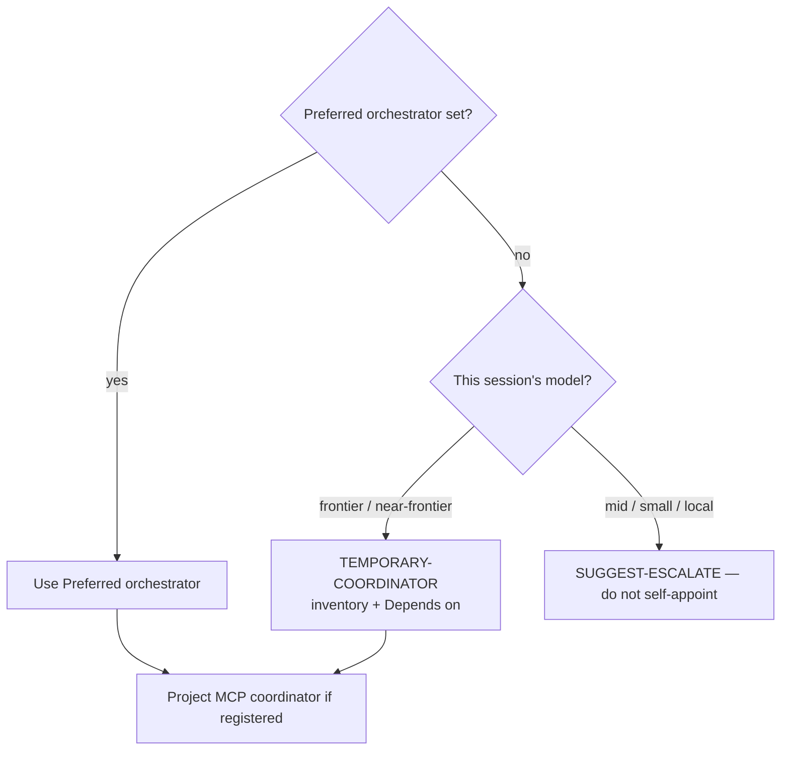

# The `anchor` CLI

`scripts/anchor.py` (run as `bin/anchor`, or `anchor` once installed) scaffolds a project with Anchor doctrine for whichever model platform(s) you're targeting. It never overwrites: any destination file that already exists is reported as a conflict and nothing is written, so you can resolve it and re-run.

**Hard rule (all projects):** docs describe **current shipped state**, not plan backlog. Never document the **contents** of `.plans/` as product docs or roadmap; when plan work ships, document the code. Documenting the `.plans/` **workflow** is fine when it is a shipped feature. See doctrine and mythos-core rule 12.

## Install

Pick one — both run the same script:

- **No install**: symlink `bin/anchor` onto your `PATH` (`ln -s "$(pwd)/bin/anchor" /usr/local/bin/anchor`), or call it directly as `python3 scripts/anchor.py`.
- **`pip install -e .`** (or `pipx install .`) from the repo root gives a real `anchor` command. This only installs the scaffolder — the fleet scripts (`orchestrate.py`, `router.py`, ...) stay copy-paste by design, since they're meant to be dropped standalone into other repos.

## Set defaults (optional)

`./config.sh` (or `/config` in Claude Code / Grok Build) asks which platform(s), fleet tooling, default language/framework, **model priority**, and **preferred orchestrator** you want, and saves the answer to `~/.config/anchor/defaults` (override with `$ANCHOR_CONFIG_DIR`). With saved defaults, `anchor <project-dir>` alone scaffolds without any flags. Re-run `./config.sh` any time to change your mind, or `./config.sh --show` to print what's saved.

```bash
./config.sh --platform claude,grok --fleet --language node \
  --model-priority nim,claude:sonnet,claude:opus \
  --orchestrator claude:opus
```

## Preferred orchestrator (per project)

Who should **plan multi-step work and coordinate** for this project (including cross-plan **Depends on** analysis). Written into `ANCHOR-CONVENTIONS.md` so lesser models recommend it instead of attempting orchestration themselves.

```bash
# Trivial: existing project (no full re-scaffold)
anchor <project-dir> --set-orchestrator claude:opus

# At scaffold time
anchor <project-dir> --platform claude,local:qwen3 --orchestrator claude:opus

# Or hand-edit the bold line in ANCHOR-CONVENTIONS.md:
# **Preferred orchestrator:** `claude:opus`
```



**If unset:** a **frontier or near-frontier** model in the current session may act as a **temporary coordinator** (inventory `.plans/**`, propose dependencies, draft under `drafts/`). It should announce `TEMPORARY-COORDINATOR: <name> — Preferred orchestrator unset` and still recommend setting a durable orchestrator. Mid/small/local models must escalate rather than self-appoint. A project MCP coordinator, when registered, is the durable machine-side coordinator; the dashboard monitors those servers only.

## Scaffold a project

```bash
anchor <project-dir>                                     # interactive survey (or saved defaults)
anchor <project-dir> --platform claude,grok               # non-interactive
anchor <project-dir> --platform local:qwen3,local:gemma3 --fleet
anchor <project-dir> --framework rust                      # skip framework detection/prompt
anchor <project-dir> --orchestrator claude:opus            # preferred planner/coordinator
anchor --list                                               # show platform keys
anchor <project-dir> --platform claude --dry-run            # preview, write nothing
```

Platform keys: `claude`, `grok`, `nemotron`, `local:<model>` (`qwen3`, `gemma3`, `mistral-small`, `deepseek-r1-distill`, `llama33`), `chat`. Add `--fleet` to also copy orchestrator/fleet tooling (`scripts/`, `mcp/`).

Every run also detects the target project's language/framework from marker files (`package.json`, `Cargo.toml`, `go.mod`, ...) and writes idiomatic-composition guidance to `ANCHOR-CONVENTIONS.md` (including Preferred orchestrator, **temporary coordinator** fallback for frontier sessions when unset, and lesser-model deferral). If detection fails and the terminal is interactive, it asks — proposing your saved language default, if any.

## Check for drift

Every scaffold writes `.anchor-manifest.json`, recording the anchor commit, platforms, and file hashes used. Doctrine files are a one-time copy with no update path otherwise:

```bash
anchor <project-dir> --check
```

This reports each manifest-tracked file as unchanged, locally modified, upstream-updated, or missing — a diff-and-decide tool that never writes anything.
