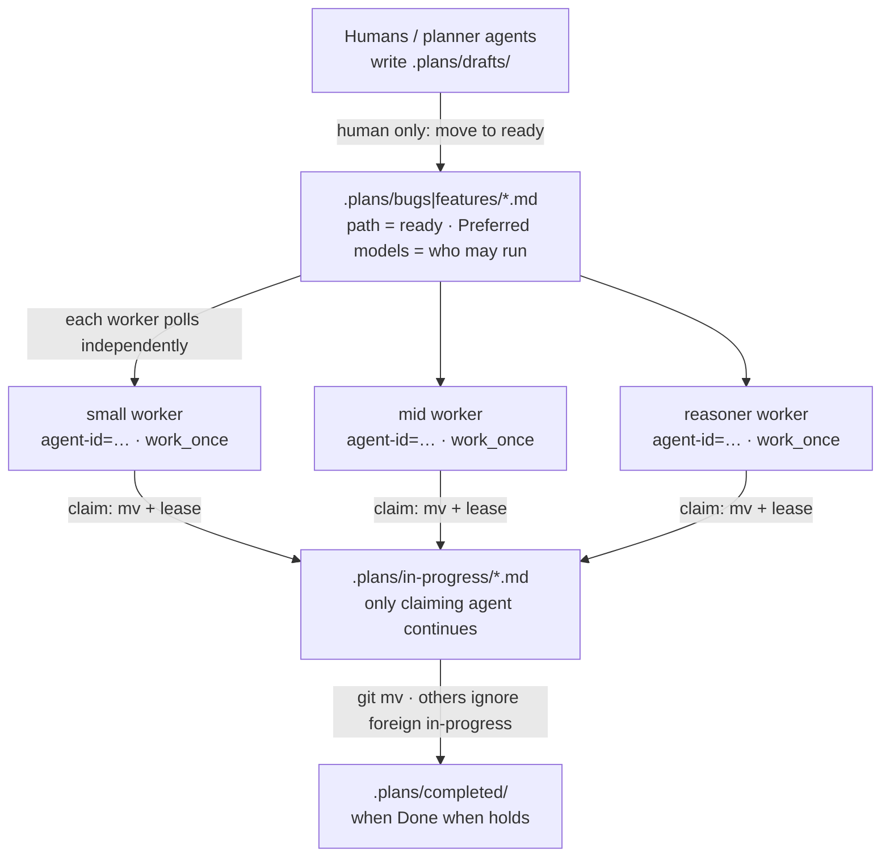
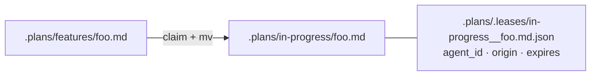

# Multi-agent fleet workers

Configure several agents—with **different model capabilities**—to watch a project’s **`.plans/`** tree and pull only the plans they are fit to complete (and whose **Depends on** are met). This is the headless companion to interactive [**`/work`**](../skills/work): same priority, Preferred-models, and dependency rules; no central assigner; no daemon baked into `/work` itself.

**Operator shortcut:** run [**`/fleet-watch`**](../skills/fleet-watch) in your coding agent from the project (or `/fleet-watch my-app` from the Anchor repo) to inspect and install **reboot-persistent** watchers. You should not need to memorize CLI flags—the skill is the entrypoint.

## What you are building



**Pull, don’t push.** Every worker decides “is there a plan *I* should take?” using its own tier and name. There is no shared job server that assigns work to models.

## Prerequisites

1. Project has a **`.plans/`** tree (scaffold creates it): `bugs/`, `features/`, `in-progress/`, `ambiguous/`, `blocked/`, `drafts/`, `completed/`.
2. Plans that should run live under **`bugs/`** or **`features/`** only (then claim → `in-progress/`). Path is authoritative—see [`.plans/README`](https://github.com/carefreeinv/anchor/blob/main/anchor/scaffold/plans/README.md) and [doctrine](../doctrine).
3. Each plan header includes **Preferred models** and **Depends on** (slugs or `none`), e.g.:

   ```markdown
   - **Value:** medium
   - **Preferred models:** mid, Grok 4.5, Qwen3 32B
   - **Depends on:** other-slug   # or `none` after checking existing plans
   ```

4. Fleet tooling available in the project (or Anchor repo): `scripts/work_once.py`, `plan_select.py`, `plan_lease.py`, optionally `orchestrate.py` + `endpoints.yaml`.
5. Unique **`--agent-id`** per concurrent worker so `in-progress/` ownership is clear; never execute a plan under `in-progress/` you did not move there.
6. Workers **skip** plans with unmet **Depends on** (dependency still open / not completed).
7. **Preferred orchestrator** for the project (who plans, coordinates, and analyzes cross-plan deps—not every swarm node):

   ```bash
   # Existing project (one command)
   anchor /path/to/project --set-orchestrator claude:opus

   # Or edit ANCHOR-CONVENTIONS.md → **Preferred orchestrator:** `claude:opus`

   # Defaults for new scaffolds
   ./config.sh --platform claude,local:qwen3 --orchestrator claude:opus --model-priority local,claude:sonnet,claude:opus
   ```

   If **unset**, a frontier/near-frontier interactive session may act as **temporary coordinator** (`TEMPORARY-COORDINATOR: …`). Mid/small/local workers must not self-appoint—escalate. Durable MCP coordinators (when installed) are separate from these pull workers; a dashboard monitors coordinators only via their exposed stats APIs.

## Capability tiers

Workers declare a **fit tier** that matches plan Preferred-models vocabulary:

| Fit tier | Typical models / registry tiers | Takes plans preferred for… |
|---------|----------------------------------|----------------------------|
| `small` | Haiku, [Qwen3](https://qwen.readthedocs.io/en/latest/getting_started/quickstart.html) ≤8B, swarm | `small` (and name matches) |
| `mid` | Sonnet-class, Grok 4.5, [Qwen3](https://qwen.readthedocs.io/en/latest/getting_started/quickstart.html) 32B, `executor` / `executor-heavy` | `mid` |
| `reasoner` | Opus-class, Nemotron thinking-on, [R1 distill](https://huggingface.co/collections/deepseek-ai/deepseek-r1) | `reasoner` |
| `frontier` | Fable-class | `frontier` |

Registry mapping (`endpoints.yaml` → fit tier), used when you pass `--endpoint`:

| `endpoints.yaml` `tier` | Fit tier |
|-------------------------|----------|
| `swarm` | `small` |
| `executor`, `executor-heavy`, `detached` | `mid` |
| `reasoner` | `reasoner` |
| `frontier` | `frontier` |

**Bare pick behavior** (same as `/work`):

- **good** / **unknown** fit → eligible (if **Depends on** met)  
- **overqualified** (e.g. frontier on `small`-only) → skip; leave for cheaper workers  
- **underqualified** (e.g. small on `reasoner`) → skip; leave for stronger workers  
- **unmet Depends on** → skip; leave until dependency is completed  

Override only when intentional: `--no-fit-check`, `--no-dep-check`, or a named `--slug` / `--path` (still **one** plan per pick; state mismatches).

## Configure one worker

Each worker process needs four things:

| Setting | Flag / source | Example |
|---------|---------------|---------|
| Project root | `--root` | `/home/ops/myapp` |
| Identity | `--agent-id` | `mid-h100-a` (unique per concurrent process) |
| Capability | `--tier` or `--endpoint` | `--tier mid` or `--endpoint h100-executor` |
| Model name (optional) | `--model` | improves Preferred-models **name** matching |

```bash
cd /path/to/project

# Inspect what this worker would see
python /path/to/anchor/scripts/work_once.py \
  --root . --list --tier mid --model "Qwen3-32B"

# Claim one eligible plan; print absolute path (outer agent executes)
python /path/to/anchor/scripts/work_once.py \
  --root . --once --tier mid --agent-id mid-h100-a

# Or claim and hand off to orchestrate.py
python /path/to/anchor/scripts/work_once.py \
  --root . --once --endpoint h100-executor \
  --registry /path/to/anchor/scripts/endpoints.yaml \
  --agent-id mid-h100-a --run
```

**Exit codes** (for monitors and systemd):

| Code | Meaning |
|------|---------|
| `0` | Listed OK, or claimed ≥1 plan |
| `1` | Nothing to do (empty ready lanes, no fit, or all claimed) |
| `2` | Hard error (no `.plans/`, blocked path, bad args) |

Treat **exit 1 as normal idle**, not failure—pollers should sleep and retry.

## Configure a multi-capability fleet

Give each capability its own **agent-id**, schedule, and (ideally) **worktree or clone** if workers write to the same git repo.

### 1. Register endpoints

```yaml
# scripts/endpoints.yaml (excerpt)
endpoints:
  - name: laptop-swarm
    tier: swarm
    base_url: http://127.0.0.1:8001/v1
    model: Qwen/Qwen3-8B

  - name: h100-executor
    tier: executor-heavy
    base_url: http://10.0.1.10:8000/v1
    model: Qwen/Qwen3-32B-FP8

  - name: h100-nemotron
    tier: reasoner
    base_url: http://10.0.1.11:8000/v1
    model: nvidia/llama-3.3-nemotron-super-49b-v1
```

### 2. One poller per capability

**Cron** (simple; one shot per tick):

```cron
# m h dom mon dow command
*/10 * * * *  cd /srv/myapp && python /opt/anchor/scripts/work_once.py --once --endpoint laptop-swarm   --agent-id swarm-cron    --registry /opt/anchor/scripts/endpoints.yaml >>/var/log/anchor-swarm.log 2>&1
*/5  * * * *  cd /srv/myapp && python /opt/anchor/scripts/work_once.py --once --endpoint h100-executor --agent-id mid-cron      --registry /opt/anchor/scripts/endpoints.yaml >>/var/log/anchor-mid.log 2>&1
*/15 * * * *  cd /srv/myapp && python /opt/anchor/scripts/work_once.py --once --endpoint h100-nemotron --agent-id reasoner-cron --registry /opt/anchor/scripts/endpoints.yaml >>/var/log/anchor-reasoner.log 2>&1
```

**systemd timer** (per worker unit):

```ini
# /etc/systemd/system/anchor-work-mid.service
[Unit]
Description=Anchor mid-tier plan pull (one shot)
After=network.target

[Service]
Type=oneshot
WorkingDirectory=/srv/myapp
User=anchor
ExecStart=/usr/bin/python3 /opt/anchor/scripts/work_once.py --once --tier mid --model Qwen3-32B --agent-id mid-unit
# Exit 1 = idle; do not mark the unit failed for empty backlog
SuccessExitStatus=0 1
```

```ini
# /etc/systemd/system/anchor-work-mid.timer
[Unit]
Description=Poll .plans for mid-fit work every 5 minutes

[Timer]
OnBootSec=2min
OnUnitActiveSec=5min
Persistent=true

[Install]
WantedBy=timers.target
```

Enable with `systemctl enable --now anchor-work-mid.timer` (and parallel units for `small` / `reasoner` with different `--tier` and `--agent-id`).

**Outer coding agent** (Claude Code, Grok Build, etc.) on a machine that already has tools:

```bash
# Claim path only; agent loads the plan and runs /work steps itself
PLAN=$(python scripts/work_once.py --once --tier mid --agent-id grok-session-$$)
# exit 1 → sleep; exit 0 → $PLAN is absolute path under .plans/bugs|features
```

Interactive agents can still use **`/work`** in a human session; fleet pollers use **`work_once.py`**. Do not turn `/work` into a long-running daemon.

### 3. How “new eligible plans” appear

Workers do **not** watch `drafts/` or chat. Eligibility is entirely filesystem:

| Event | Who | Effect |
|-------|-----|--------|
| New file under `drafts/` | planner / human | **Not** executable; pollers ignore |
| Human `git mv` (or move) into `bugs/` or `features/` | human | Plan becomes ready on next poll |
| Header `Preferred models: small` | plan author | Only small-fit workers pick it on bare pull |
| Claim → `in-progress/` + lease | first claimer | Plan leaves ready lanes; **only that agent_id continues it** |
| Foreign `in-progress/` | other workers | **Ignore** — do not list as pickable, do not execute |
| Park → `ambiguous/` or `blocked/` | agent | Half-baked or cannot-fix; **not** auto-picked |
| Return → `bugs/`\|`features/` | agent | Release claim or unpark when ready again |
| `git mv` → `completed/` | owning executor when Done when holds | Leaves in-progress |

So “monitor the project folder” means: **poll `.plans/bugs`, `.plans/features`, and your own `.plans/in-progress`**, not the whole monorepo. Prefer promoting drafts only when acceptance criteria and Preferred models are filled in.

### 4. Isolation (git multi-writer)

Leases prevent two workers from **starting** the same plan; they do **not** merge git trees.

| Pattern | When to use |
|---------|-------------|
| **One writer clone** | Single machine; all tiers share one checkout; only one process writes at a time |
| **Per-worker worktree** | Parallel execution; each agent-id has `git worktree add …`; merge/PR when done |
| **Read-only claim + human merge** | Worker prints path; human or CI runs steps and commits |

v1 intentionally is **not** a multi-tenant queue product. Prefer one active writer per clone.

## Leases and claims

On successful pick, `work_once.py` **moves** the plan and writes a lease:



(Leases are gitignored via scaffold `.plans/.gitignore`.) Fields: `agent_id`, `origin` (prior path), `claimed_at`, `expires_at` (default TTL 3600s; override with `--lease-ttl`).

- **Ownership** → only that `agent_id` may resume/execute the in-progress file; everyone else ignores it.
- **Double claim** → second worker sees the plan gone from ready lanes; exit 1 if nothing else fits.
- **Stale lease** → expired leases can be reclaimed (orphan in-progress reclaimable carefully).
- **Release early**:  
  `python scripts/work_once.py --release in-progress/foo.md --agent-id mid-h100-a`
- Failed `--run` (orchestrate) **leaves the plan in `in-progress/` with the lease**—fix the failure or wait for TTL.

## Bounded loop vs one-shot

| Mode | Flag | Use |
|------|------|-----|
| One plan | `--once` (default when not listing) | Cron / timer / agent turn |
| Up to N plans | `--max-plans N` | Drain a burst without “run forever” |
| Inventory only | `--list` | Debugging fit; no claim |

Never “drain entire backlog forever” as the default—bounded polls keep economics and blast radius under control.

*Right-sized fleet pull is a big part of the [Savings](../savings) story — please consider [donating](https://donate.stripe.com/28E6oHeq8fxQ5p7fmBdjO01) to help support this project.*

## End-to-end checklist

1. [ ] Scaffold or copy `.plans/` + ignore `*.local.md` and `.leases/`.
2. [ ] Authors set **Preferred models** on every ready plan.
3. [ ] Humans promote only ready work: `drafts/` → `bugs|features/`.
4. [ ] Each worker has unique `--agent-id` and correct `--tier` / `--endpoint`.
5. [ ] Pollers treat exit `1` as idle; alert only on exit `2` or repeated claim storms.
6. [ ] Git isolation agreed (single writer vs worktrees).
7. [ ] On completion, executor archives: `git mv .plans/in-progress/<slug>.md .plans/completed/`.
8. [ ] Spot-check with `--list` per tier (deps column shows met/UNMET):

```bash
python scripts/work_once.py --list --tier small
python scripts/work_once.py --list --tier mid
python scripts/work_once.py --list --tier reasoner
```

You should see the same paths with different **fit** columns (`good` / `overqualified` / `underqualified`).

## Related

- [**`/work`**](../skills/work) — interactive pick/execute contract
- [**`/fleet-watch`**](../skills/fleet-watch) — install durable timers for a project
- [Doctrine — tracked plans](../doctrine)
- [Playbook — orchestrator pattern](../playbook)
- [Model fitness](../model-fitness) — who should take which work
- [Utility scripts](scripts) — `work_once`, `orchestrate`, registry
- Source: `scripts/work_once.py`, `scripts/plan_select.py`, `scripts/plan_lease.py`
