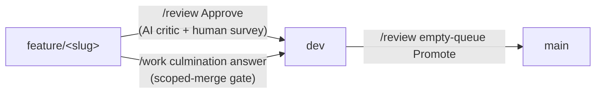

# How work reaches `dev`

Getting finished work from a plan onto the integration branch is the least legible
part of the workflow. There are exactly **two** routes onto `dev`, one route onto
`main`, and one command that only ever reports.



## The two routes onto integration

| | [`/review`](/skills/review) Approve | [`/work`](/skills/work) scoped merge |
|---|---|---|
| Authorization | Human survey after an AI critic pass | Human answers `/work`'s end-of-run question, in-session |
| Scope | The whole `feature/<slug>` branch | The branch **and** its file set must be inside what that `/work` run touched |
| AI critic | Yes | No — the operator is the reviewer |
| Target | `dev`; and `dev` → `main` on Promote | `dev` only. **Never `main`/`master`** |
| Unattended runs (fleet, `work_once.py`, MCP) | n/a | **Never** — the question needs a human answer |
| Plan ends in | `completed/` | `completed/`, with a `## Handoff` note recording the skipped review |

Both are human-authorized. The difference is *what* the human is trusting: a critic
pass plus a survey, or their own attention during a run they just watched.

## The scoped-merge gate

The `/work` route trades the critic for a narrower mandate, so a mechanical gate
proves the branch is exactly what the run thinks it is. All of it must hold:

1. **Provenance** — the branch head is the commit that run just made.
2. **Clean tree** — nothing staged, unstaged, or untracked.
3. **File scope** — every path named **anywhere in the range history**
   (`base..head`), not only the net tree-to-tree diff, is inside the run's
   declared touched set (plan `Touches`, the plan's own lane move, what
   `/commit-prep` reported). A path added and then deleted still counts.
4. **Mergeable** — fast-forward preferred; otherwise a conflict-free merge.
5. **Target** — integration only; a mainline target aborts the merge path.
6. **Human answer** — in this session, in response to the question. Never a flag,
   never a config default, never an earlier "yes".

```bash
python scripts/merge_feature.py --root <checkout> --slug <slug> \
  --touched touched.txt --expect-head <sha> --dry-run
# 0 would merge · 3 scope violation · 4 precondition · 5 conflict · 2 git error
#                                              6 merge staged, not committed
```

**Exit `6` is not a failure and not a success.** A merge that cannot fast-forward
creates a commit, and a commit is gated *before* it exists — so the run stages the
merge and stops, leaving the tree parked on the integration branch with the merge
in the index. Nothing has been committed yet. Run `/commit-prep` against that
merged tree, then finish it:

```bash
python scripts/merge_feature.py --root <checkout> --commit-staged   # prep green
python scripts/merge_feature.py --root <checkout> --abort-staged    # prep red
```

`--commit-staged` stages prep's own edits along with the merge and commits both,
then returns to the branch you started on. `--abort-staged` unwinds the merge and
leaves the integration branch untouched. Leaving a run at exit `6` without doing
either leaves the checkout mid-merge, so treat it as work in progress, not a
result.

Both finishers check that the merge they recorded is still the merge in front of
them, and refuse rather than guess — `MERGE_HEAD` existing is not enough, so it is
compared against the exact commit that was merged and a *different* staged merge is
refused rather than committed under this plan's name. The comparison is against
that commit, not the branch name: the branch is expected to move, since committing
a fix is how a red prep gets resolved. If you resolved the merge by hand in between,
`--commit-staged` refuses (exit `4`) instead of committing whatever is now in the
tree, and `--abort-staged` clears the stale record **without** resetting anything
— a `reset --hard` against a tree the record no longer describes would destroy
unrelated uncommitted work rather than undo a merge. If a merge is in progress on
a *different* branch than the one recorded, both refuse.

Staging a merge also requires `--root` to be fit for one. It is refused when that
checkout already has a merge in progress or an unfinished staged record — the
conflict probe would otherwise abort another agent's staged merge, and both skills
point every agent at the same shared checkout — and when it holds uncommitted or
untracked files, which `--commit-staged`'s `git add -A` would otherwise sweep into
the merge commit. Note this is a *different* check from the clean-tree gate, which
follows the feature branch's worktree: the tree that did the work and the tree the
merge lands in are different directories on the topology `/work` recommends.

`--expect-head` is **required**: without the SHA the run committed there is no way
to tell the branch has not moved since, and provenance is a must-hold condition
rather than an optional extra.

The clean-tree check follows the **feature branch's** worktree, not `--root`, so
pointing `--root` at the integration checkout still checks the tree that did the work.
Point `--root` at a checkout where the integration branch is **free**. Git will not
check out a branch that is live in another worktree, which is the normal Anchor
topology — `/work` in `var/worktrees/<agent>`, your main checkout sitting on `dev`.
The gate detects that up front and refuses with the path to re-run against, rather
than passing and then failing mid-merge.

Any failure falls back to `/review`, naming the check that refused. Refusing is
always the safe outcome: a scope violation in particular means the branch carries
something the operator did not watch happen, which is exactly when a review pass
earns its cost.

**Landing only the in-scope paths is rejected by design.** Cherry-picking files out
of a branch fabricates a commit matching no branch state and hides the out-of-scope
change.

## Seeing what has not landed

`pending_merges.py` answers "what is finished but not on `dev`", including where the
work physically sits:

```bash
python scripts/pending_merges.py            # table: branch, target, ahead, worktree, plan lane, held
python scripts/pending_merges.py --brief    # one line, for the tail of another command
python scripts/pending_merges.py --json     # machines
```

A plan whose body carries a `## Handoff` hold note shows as **held** — finished work
its operator deliberately parked for testing, which is visibly different from work
nobody has looked at yet. `/commit-prep` prints this table after its three gates as **advisory** output: unmerged branches are the normal state of a
healthy repo, they never make prep red, and prep itself never commits, pushes, or
merges.
