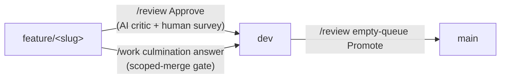

# How work reaches `dev`

Getting finished work from a plan onto the integration branch is the least legible
part of the workflow. There are exactly **two** routes onto `dev`, one route onto
`main`, and one command that only ever reports.



## The two routes onto integration

| | [`/review`](/skills/review) Approve | [`/work`](/skills/work) scoped merge |
|---|---|---|
| Authorization | Human survey after an AI critic pass | Human answers `/work`'s end-of-run question, in-session |
| Scope | The whole `feature/<slug>` branch | The branch **and** its file set must be inside what that `/work` run touched |
| AI critic | Yes | No — the operator is the reviewer |
| Target | `dev`; and `dev` → `main` on Promote | `dev` only. **Never `main`/`master`** |
| Unattended runs (fleet, `work_once.py`, MCP) | n/a | **Never** — the question needs a human answer |
| Plan ends in | `completed/` | `completed/`, with a `## Handoff` note recording the skipped review |

Both are human-authorized. The difference is *what* the human is trusting: a critic
pass plus a survey, or their own attention during a run they just watched.

## The scoped-merge gate

The `/work` route trades the critic for a narrower mandate, so a mechanical gate
proves the branch is exactly what the run thinks it is. All of it must hold:

1. **Provenance** — the branch head is the commit that run just made.
2. **Clean tree** — nothing staged, unstaged, or untracked.
3. **File scope** — every changed path is inside the run's declared touched set
   (plan `Touches`, the plan's own lane move, what `/commit-prep` reported).
4. **Mergeable** — fast-forward preferred; otherwise a conflict-free merge.
5. **Target** — integration only; a mainline target aborts the merge path.
6. **Human answer** — in this session, in response to the question. Never a flag,
   never a config default, never an earlier "yes".

```bash
python scripts/merge_feature.py --root <checkout> --slug <slug> \
  --touched touched.txt --expect-head <sha> --dry-run
# 0 would merge · 3 scope violation · 4 precondition · 5 conflict · 2 git error
```

`--expect-head` is **required**: without the SHA the run committed there is no way
to tell the branch has not moved since, and provenance is a must-hold condition
rather than an optional extra.

Point `--root` at a checkout where the integration branch is **free**. Git will not
check out a branch that is live in another worktree, which is the normal Anchor
topology — `/work` in `var/worktrees/<agent>`, your main checkout sitting on `dev`.
The gate detects that up front and refuses with the path to re-run against, rather
than passing and then failing mid-merge.

Any failure falls back to `/review`, naming the check that refused. Refusing is
always the safe outcome: a scope violation in particular means the branch carries
something the operator did not watch happen, which is exactly when a review pass
earns its cost.

**Landing only the in-scope paths is rejected by design.** Cherry-picking files out
of a branch fabricates a commit matching no branch state and hides the out-of-scope
change.

## Seeing what has not landed

`pending_merges.py` answers "what is finished but not on `dev`", including where the
work physically sits:

```bash
python scripts/pending_merges.py            # table: branch, target, ahead, worktree, plan lane, held
python scripts/pending_merges.py --brief    # one line, for the tail of another command
python scripts/pending_merges.py --json     # machines
```

A plan whose body carries a `## Handoff` hold note shows as **held** — finished work
its operator deliberately parked for testing, which is visibly different from work
nobody has looked at yet. `/commit-prep` prints this table after its three gates as **advisory** output: unmerged branches are the normal state of a
healthy repo, they never make prep red, and prep itself never commits, pushes, or
merges.
