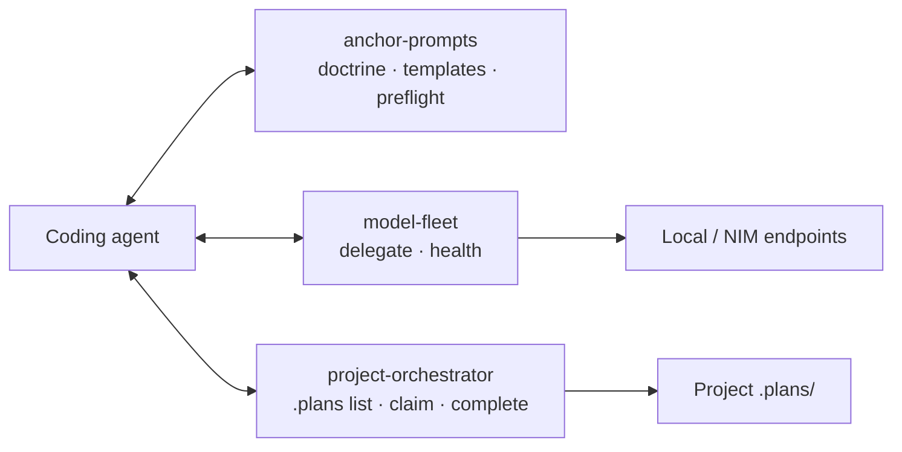

# MCP servers

Three stdio servers ship in `mcp/`, installable into Claude Code, Grok Build (if MCP-capable), or any MCP client:

- **anchor-prompts** — makes a lesser model *behave* (doctrine, templates, preflight)
- **model-fleet** — makes a frontier model *delegate* to OpenAI-compatible endpoints
- **project-orchestrator** — binds to **one project** and exposes a **limited** `.plans/` surface (list/claim/complete, deps suggest, stale warnings)



Until a Preferred orchestrator is set for a project, a frontier session may act as temporary coordinator (see [CLI — Preferred orchestrator](/tooling/cli#preferred-orchestrator-per-project)).

## anchor-prompts

The discipline as callable tools, so weak models fetch structure instead of having to remember it:

- `get_doctrine` / `get_system_prompt(model)` / `get_template(name)` — the doctrine, mythos-core (or per-model variant), and the four templates
- `tune_prompt(rough_task)` — cheap-model spec rewriting via the fleet
- `preflight_check(task_spec)` — **deterministic** gate: missing sections or unresolved TODOs → "do not execute." This is the check small models always skip, done in code where it can't be skipped.
- Prompt scaffolds: `plan_task(goal)`, `critique_work(spec, work)`

## model-fleet

The delegation arm of the orchestrator pattern:

- `delegate(task_spec, role, thinking)` — ship a self-contained spec to the right tier; output format-gated on return
- `delegate_parallel_review(task_spec, work)` — two independent critics must agree; disagreement → HOLD (the Space-1 verify-twice rule, available everywhere)
- `list_fleet` / `fleet_health` — registry view and reachability sweep

## project-orchestrator

**Per-project** limited plan coordinator (`mcp/project-orchestrator/`). One server process is bound to one project root (`--project` or `.anchor/mcp.yaml`). Tools only touch that tree’s `.plans/` — no promote, no plan-file writes, no MCP-initiated git push.

| Cap | Tools (v1) | Notes |
|-----|------------|--------|
| L0 | `project_info`, `plans_list`, `plan_read`, `conventions_get`, `plans_inventory_for_deps`, `plans_stale_report` | stale/tier-gap warnings are warn-only |
| L0.5 | `plans_suggest_dependencies` | heuristic token overlap; **propose only** (no LLM) |
| L1 | `plans_claim`, `plans_release`, `plans_complete` | complete is **move only** (client asserts Done when) |

Toolsets are **role-scoped** (`scripts/roles.py`): start the server with `--role planner` or `--role critic` and the L1 lifecycle tools are never registered — the session cannot see them (deny by omission, not refusal). `--role executor` or no `--role` keeps the full surface. Role scoping hardens the orchestrated path only; a session without the server is bound by prompt doctrine alone.

Uses the same `plan_select` / `plan_lease` rules as [`/work`](/skills/work) and `work_once` — including auto-refusing a claim on a plan with a human **Assignee** (a person completes it; agents may still edit its body). Use a **distinct** `--agent-id` from fleet_watch timers. Full matrix and registration examples: `mcp/project-orchestrator/README.md`.

```bash
claude mcp add anchor-prompts -- python /abs/path/mcp/anchor-prompts/server.py
claude mcp add model-fleet   -- python /abs/path/mcp/model-fleet/server.py
claude mcp add myapp-orch -- python /abs/path/mcp/project-orchestrator/server.py \
  --project /abs/path/to/myapp --agent-id cursor-mid-1 --tier mid
```
