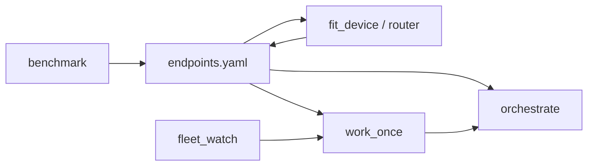

# Utility scripts

`scripts/` — Python, OpenAI-compatible everywhere. `pip install -r scripts/requirements.txt`, then point `endpoints.yaml` at your nodes. Model quirks ([Gemma](https://ai.google.dev/gemma/docs/core) system-folding, [Qwen3](https://qwen.readthedocs.io/en/latest/getting_started/quickstart.html)/Nemotron toggles, `<think>` stripping) live in `anchor_client.py`, keyed by each endpoint's `quirks:` block — callers never special-case models.



## endpoints.yaml

The fleet registry: endpoints with `tier` (swarm / executor / executor-heavy / reasoner / frontier / detached) and a `roles:` map giving tier preference order per role (tuner, executor, critic, planner).

## prompt_tuner.py

Playbook move #3 as a command: `python prompt_tuner.py "fix the login bug"` → a filled task-spec from a cheap model, with honest `TODO(owner):` markers where the rough description was silent. Never invents details — an honest TODO is a success, a plausible invention is a failure.

## router.py

The "which tier deserves this task" rule as code: regex heuristics first (free), optional tiny-model classification fallback. `--send` dispatches immediately with the mythos-core system prompt.

## work_once.py

Headless puller for multi-tier fleets: same priority + Preferred-models fit + **Depends on** checks as interactive `/work`, one claim per invocation (optional `--max-plans N`). Each worker passes `--tier` or `--endpoint` and a unique `--agent-id`; claims **move** plans to `.plans/in-progress/` and write leases under `.plans/.leases/`. Other agents ignore foreign in-progress work. Unmet dependencies are skipped (`--no-dep-check` to override). Park half-baked/stuck work: `--park ambiguous|blocked`. Return to ready: `--return-ready`. Parallel code edits: **`worktree_for_agent.py`** or `work_once.py --ensure-worktree` (one worktree per agent-id under `var/worktrees/`). Exit `1` means idle backlog (normal for cron). Full setup: [Fleet workers](fleet-workers).

```bash
python work_once.py --list --tier mid --agent-id mid-1
python work_once.py --once --endpoint h100-executor --agent-id mid-1 --run
python work_once.py --path .plans/in-progress/x.md --park blocked --agent-id mid-1
```

Shared selection: `plan_select.py` (fit + deps). Claims + moves: `plan_lease.claim_and_move` / `park` / `return_to_ready`.

## fleet_watch.py

Implementation behind the [**`/fleet-watch`**](../skills/fleet-watch) skill (prefer the skill in an agent). Direct CLI for automation/CI: `--project`, `--status`, `--list` / `--once`, `--emit systemd|cron`, `--install-user` (systemd **user** timers; reboot-safe with `loginctl enable-linger $USER`). See [Fleet workers](fleet-workers) for the pull model.

```bash
python fleet_watch.py --project /path/to/app --status
python fleet_watch.py --project /path/to/app --emit systemd \
  --worker tier=mid,agent=mid-1,interval=5m
```

## pending_merges.py

Advises which finished work is committed but **not yet merged** into integration. For each local branch it counts commits the merge target doesn't have — `feature/*` → `dev`/`develop` (else `main`/`master`), and `dev`/`develop` → mainline — and flags any `feature/<slug>` that matches a plan under `.plans/completed/` as **completed work awaiting merge**. Advisory by default; pass `--exit-code` to return `1` when anything is pending (for a coordinator, monitor, or CI to surface), `--json` for machines.

```bash
python pending_merges.py                 # human table
python pending_merges.py --json --exit-code
```

## orchestrate.py

The whole loop: plan (planner role or `--plan-file`) → split into tasks → execute each in a fresh context → verify with your `--verify` command → two-strike escalate or `--hold-on-fail` (detached mode) → fresh-context critic review → JSON run report. Format-gates every executor output (missing footer = failed attempt). Often invoked by `work_once.py --run` after a claim.

## benchmark.py

Playbook move #5: your tasks (JSONL with pass regexes) across your endpoints → CSV + per-endpoint pass-rate/latency table. That table *is* your routing policy, derived from your own data instead of leaderboards.

## fit_device.py

The on-ramp for the [personal-devices tier](../hardware/personal-devices): `python fit_device.py --memory <GB> [--backend metal|mlx|cuda]` picks the most capable model that fits a Mac Mini, AI laptop, or single-GPU desktop, then prints a launch command and an `endpoints.yaml` stanza with the right quirks. Memory is a conservative weights+KV+overhead estimate — confirm with `benchmark.py`.
