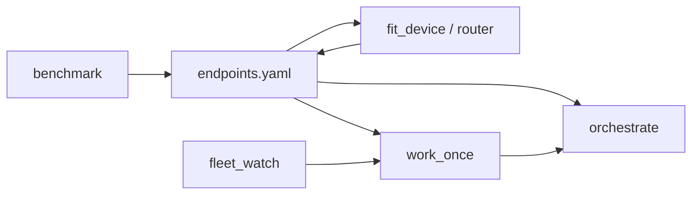

# Utility scripts

`scripts/` — Python, OpenAI-compatible everywhere. `pip install -r scripts/requirements.txt`, then point `endpoints.yaml` at your nodes. Model quirks ([Gemma](https://ai.google.dev/gemma/docs/core) system-folding, [Qwen3](https://qwen.readthedocs.io/en/latest/getting_started/quickstart.html)/Nemotron toggles, `<think>` stripping) live in `anchor_client.py`, keyed by each endpoint's `quirks:` block — callers never special-case models.


```mermaid
flowchart LR
  ep["endpoints.yaml"]
  fit["fit_device / router"]
  wo["work_once"]
  fw["fleet_watch"]
  orch["orchestrate"]
  bench["benchmark"]

  ep --> fit
  ep --> wo
  ep --> orch
  fit --> ep
  fw --> wo
  wo --> orch
  bench --> ep
```

## endpoints.yaml

The fleet registry: endpoints with `tier` (swarm / executor / executor-heavy / reasoner / frontier / detached) and a `roles:` map giving tier preference order per role (tuner, executor, critic, planner).

## prompt_tuner.py

Playbook move #3 as a command: `python prompt_tuner.py "fix the login bug"` → a filled task-spec from a cheap model, with honest `TODO(owner):` markers where the rough description was silent. Never invents details — an honest TODO is a success, a plausible invention is a failure. Pass `--target <endpoint-name>` (a name from `endpoints.yaml`) to have it fill the spec's `## Budget` section with that endpoint's `max_context` and a computed output ceiling; without `--target`, or if the endpoint has no `max_context`, both fields read `unspecified`. The tuning model never fills these numbers in itself — tooling overwrites whatever it wrote.

## router.py

The "which tier deserves this task" rule as code: regex heuristics first (free), optional tiny-model classification fallback. `--send` dispatches immediately with the mythos-core system prompt.

Also home to the deferred-catalog pattern for the registry itself: `summarize_endpoints(fleet)` generates a capped one-line-per-endpoint summary (name, tier, context size, one capability phrase — no `base_url`, model name, or quirk values), and `fleet_summary_block(fleet)` wraps it for splicing into a prompt. `orchestrate.py`'s planner phase and `prompt_tuner.py` (only for a routing-related rough task) inject that summary — never the raw registry. Full endpoint detail is a deliberate, on-demand `endpoint_detail(fleet, name)` call, mirrored as the model-fleet MCP's `lookup_endpoint(name)` tool; secrets never leave tooling either way (`ANCHOR_API_KEY` is an environment read at request time, not a registry field).

## plan_fit.py

**Which ready plans should I take?** — read-only triage for one worker, so fit is applied mechanically instead of judged from plan headers. Identify yourself with `--tier` / `--model` / `--endpoint`; add `--effort` for cost advice. Prints one `take:`/`skip:` line per plan with the reason, then a claim command for the top pick. It never claims, moves, or leases — pair with `plan_select.py --next --claim`. Exit `0` something eligible, `1` nothing eligible (useful in cron guards), `2` error.

**Grok family:** `--effort` sets **effective** Preferred eligibility (`low`→mid, `medium`/`high`→reasoner, `xhigh`→frontier on 4.6; 4.5 `xhigh` coerces to high/reasoner; omitted → mid). **Other products:** `--effort` is a cost dial only and does not change which plans are eligible. Optional `--profile <tag>` (`coding-agent`, `terminal-agent`, `critic`, `planner`, `general-chat`, `multimodal`, `swarm-local`) adds a soft JSON `specialty_hint` when Preferred lists known tags — mismatch is reported, not a skip. Plans with a human **Assignee** (a name/username/email, or `human`) are shown as skipped with reason `assigned to <who>` — agents never auto-claim them. `--json` for tooling, `--eligible-only` to quiet the skips, `--next` to print just the top path.

```bash
python plan_fit.py --tier mid --effort high        # what can I take, and am I overpaying?
python plan_fit.py --endpoint h100-nemotron --json
python plan_fit.py --tier mid --profile coding-agent --json
python plan_fit.py --tier small --next             # path only, for scripting
```

## work_once.py

Headless puller for multi-tier fleets: same priority + Preferred-models fit + **Depends on** checks as interactive `/work` — **ready lanes only** (never bare-picks in-progress), one claim per invocation (optional `--max-plans N`). Each worker passes `--tier` or `--endpoint` and a unique `--agent-id`; a claim **moves** the plan to `.plans/in-progress/` and writes its lease under `.plans/.leases/` atomically. Other agents ignore foreign in-progress work; there is no silent reclaim. Keep a long job alive with `--heartbeat`, take over a crashed worker's expired lease with `--recover`. Unmet dependencies are skipped (`--no-dep-check` to override). A plan whose **Assignee** is a human is refused even by name (`--allow-assigned` to force). Park half-baked/stuck work: `--park ambiguous|blocked`. Return to ready: `--return-ready`. Parallel code edits: **`worktree_for_agent.py`** or `work_once.py --ensure-worktree` (one worktree per agent-id under `var/worktrees/`). Exit `1` means idle backlog (normal for cron). Full setup: [Fleet workers](/tooling/fleet-workers).

```bash
python work_once.py --list --tier mid --agent-id mid-1
python work_once.py --once --endpoint h100-executor --agent-id mid-1 --run
python work_once.py --path .plans/in-progress/x.md --park blocked --agent-id mid-1
```

Shared selection: `plan_select.py` (fit + deps). Claims + moves: `plan_lease.claim_and_move` / `park` / `return_to_ready`.

## plan_board.py

Read-only, zero-dependency terminal kanban board for a project's `.plans/`: **Drafts | Ready | In Progress | Review Needed | Completed**, each column sorted by the same Priority → Value → mtime order as `/work`. Header shows rolling 7-day throughput (**Completed** / **Processed** into `review-needed/`), preferring `.plans/logs/*.csv` event files when present and falling back to git-commit-time/mtime otherwise. Each card shows a brief label for its most recent logged event, if any. Never writes to `.plans/`.

**`--json`** dumps the same board as stable **schema_version 1** JSON (columns, per-plan slug/lane/title/priority/value/preferred/depends_on/assignee, throughput, optional `last_event` from the log) — for CI, dashboards, and other projects that should not import Anchor internals or talk MCP. Single frame (implies `--once`); `--include-parked` adds Ambiguous/Blocked the same way as the TUI. Lane is always the filesystem directory (`bugs`, not `Ready`); column name is separate. Exit `1` only when `.plans/` is missing.

```bash
python scripts/plan_board.py               # live, redraws every 60s
python scripts/plan_board.py --once         # single frame, for piping/CI
python scripts/plan_board.py --json         # machine-readable board dump
python scripts/plan_board.py --json --include-parked
python scripts/plan_board.py --include-parked --no-color
```

Column color accents: green (Completed), yellow (Review Needed), orange (In Progress), red (everything else) — an accent only, never the sole signal; column names stay authoritative under `--no-color` or on non-TTY output (auto-disabled).

## fleet_watch.py

Implementation behind the [**`/fleet-watch`**](/skills/fleet-watch) skill (prefer the skill in an agent). Direct CLI for automation/CI: `--project`, `--status`, `--list` / `--once`, `--emit systemd|cron`, `--install-user` (systemd **user** timers; reboot-safe with `loginctl enable-linger $USER`). See [Fleet workers](/tooling/fleet-workers) for the pull model.

```bash
python fleet_watch.py --project /path/to/app --status
python fleet_watch.py --project /path/to/app --emit systemd \
  --worker tier=mid,agent=mid-1,interval=5m
```

## pending_merges.py

Advises which finished work is committed but **not yet merged** into integration. For each local branch it counts commits the merge target doesn't have — `feature/*` → `dev`/`develop` (else `main`/`master`), and `dev`/`develop` → mainline — and flags any `feature/<slug>` that matches a plan under `.plans/completed/` as **completed work awaiting merge**. Advisory by default; pass `--exit-code` to return `1` when anything is pending (for a coordinator, monitor, or CI to surface), `--json` for machines.

```bash
python pending_merges.py                 # human table
python pending_merges.py --json --exit-code
```

## orchestrate.py

The whole loop: plan (planner role or `--plan-file`) → split into tasks → execute each in a fresh context → verify with your `--verify` command → two-strike escalate or `--hold-on-fail` (detached mode) → fresh-context critic review → JSON run report. Format-gates every executor output (missing footer = failed attempt). Pass `--scope-spec <task-spec.md>` (with `--worktree <root>`) to run the **scope gate** before `--verify`: a change outside the spec's `## Files in scope` marks the task `failed-scope` and tests never run. Before every dispatch attempt it also runs a **budget gate**: if the prompt already exceeds the picked endpoint's `max_context`, the task is marked `failed-budget` and rejected outright — never truncated — because an oversized prompt means the task was decomposed wrong, not that it needs a retry. Roles are also harness-enforced per phase via the `roles.py` capability map: writes made during the planner phase outside `.plans/**`, executor writes into `.plans/**` (or its own spec), or any critic write are **role violations** — logged as events, marked `failed-role` on the task, and the run exits `4` after still emitting its outputs. Role transitions (plan approved → executors spawned → review) are explicit logged events. A task that runs out of room does not fail: at `HANDOFF_THRESHOLD` (80%) of the picked endpoint's `max_context` the dispatch carries a **budget notice** telling the executor to emit a handoff instead of a partial answer, and a handoff reply is detected *before* the footer gate (a handoff has no `## Result` footer by design) and respawned as a **fresh** continuation — `--max-respawns` (default 2, `0` disables). Each continuation restates the original task, carries forward accumulated done items and decisions as off-limits, and dispatches only the remaining sub-specs. Past the cap the task is reported back to the planner as a decomposition error rather than respawned again. Often invoked by `work_once.py --run` after a claim.

## handoff.py

The machine side of `anchor/templates/handoff.md`. `looks_like_handoff(text)` is a cheap structural check (all five required headings) so the orchestrator can tell a handoff from a normal result; `parse_handoff(text)` is a strict parse into `Handoff` (done, remaining sub-specs, decisions, files touched, concerns) that **raises** on remaining work with no `Verify by:` line — an undispatchable "finish the rest" item is what makes continuations fail, so it earns one corrective retry rather than a shrug. `check_scope_shrinks(handoff, in_scope)` rejects remaining work naming paths the original spec never allowed (reusing `scope_gate.path_matches` — compaction is a convenient place for scope creep to hide, and widening stays the planner's call). `accumulate(previous, latest)` folds earlier windows' history into the newest handoff so window 3 still knows what window 1 finished; `build_continuation(task, handoff, window=…)` produces the next window's task text — original task, done work and decisions marked do-not-redo/do-not-reverse, remaining sub-specs only.

## roles.py

The role→capability map behind ANCHOR.md's role-separation bullet — planner / executor / critic as **harness-enforced capability sets**, not prompt framing, in one module so nothing re-declares role powers elsewhere. Each `RoleCapabilities` carries writable-path allow/deny globs (reusing `scope_gate.path_matches` — one glob implementation), a `can_dispatch` flag (orchestrator only), and the MCP toolset the role may see. `check_role_writes(caps, paths)` classifies a phase's writes; unlike the scope gate it is always active (an empty allowlist means read-only). Consumed by `orchestrate.py` (per-phase enforcement) and the project-orchestrator MCP server (`--role` toolsets). Reads stay unrestricted for every role — only writes and dispatch are gated.

`orchestrate.py` appends a **claimed-vs-actual** row to `var/fleet-metrics/outcomes.jsonl` per task (override with `--metrics-ledger PATH`, disable with `--metrics-ledger ''`). The row is written **after** the executor's role check, not at the verify step, so it can carry that task's `role_verdict` — a task can pass verify and still have written outside its role boundary, and a row written earlier would score that run as an accurate claim. See `fleet_metrics.py` / `fitness_report.py`.

## fleet_metrics.py

Parse an executor `## Result` footer claim (`success` / `should-work` / `blocked` / `unparseable`), pair it with the actual verify exit (plus optional `scope_verdict` and `role_verdict`), and append metadata-only JSONL under `var/fleet-metrics/outcomes.jsonl`. No prompts or task bodies — safe even when `var/` is untracked.

## fitness_report.py

Read-only aggregate of the outcomes ledger: per-model claim accuracy, verify pass-rate, unparseable rate. Rates with **n < 5** are withheld. A row whose `role_verdict` is `fail` never counts toward positive claim accuracy — the executor reached that green by writing outside its boundary, so "it worked" is not a claim worth scoring as accurate. Does **not** rewrite `model-fitness.md` — humans update prose from the report.

```bash
python fitness_report.py
python fitness_report.py --json
python fitness_report.py --ledger var/fleet-metrics/outcomes.jsonl
```

## scope_gate.py

Machine-enforces mythos-core rule 7 ("scope is sacred"). `check_scope(diff_paths, in_scope, allowed_generated)` is a pure classifier; `worktree_changes(root)` reads the git diff (tracked vs HEAD + untracked); `enforce_scope(...)` combines them. Any changed path outside the task spec's `## Files in scope` (or an `Allowed generated files:` allowlist) is a violation. Globs are gitignore-style: `*` within a segment, `**` across segments, trailing `/` for a subtree, plain paths match exactly or as a directory prefix. Use as a **verify pre-step** so tests never run on an out-of-scope diff — `python scope_gate.py --root . --spec spec.md && pytest -q` (exit `3` = violation) — or via `orchestrate.py --scope-spec`.

## benchmark.py

Playbook move #5: your tasks (JSONL with pass regexes) across your endpoints → CSV + per-endpoint pass-rate/latency table. That table *is* your routing policy, derived from your own data instead of leaderboards.

## fit_device.py

The on-ramp for the [personal-devices tier](/hardware/personal-devices):

```bash
python fit_device.py --probe                 # detect OS/RAM/GPU/WSL + install tips + fit
python fit_device.py --memory 48 --backend metal
python fit_device.py --list
```

`--probe` prints machine facts, **markdown-friendly install links** (WSL, CUDA, llama.cpp, Ollama, vLLM, MLX), then the best lean catalog fit with HF weight links and an `endpoints.yaml` stanza. On **WSL**, it also queries the **Windows host** via `powershell.exe` (RAM/CPU/GPUs) so recommendations use bare-metal capacity and prefer a **host** model executor. Manual `--memory` / `--backend` still work. Memory is a conservative weights+KV+overhead estimate — confirm with `benchmark.py`. Agent UX: [**`/local-models`**](/skills/local-models).
